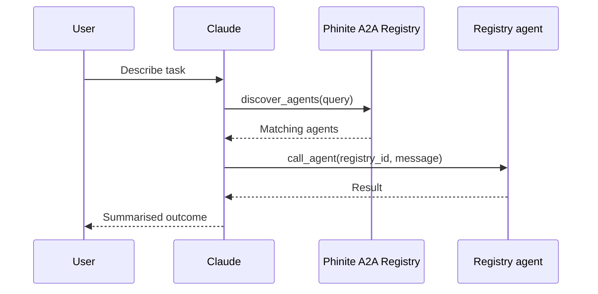

---

## title: "Invoke A2A agents from Claude"
description: "Install the Phinite Connector in Claude, discover registry agents, run tasks, and complete credential setup for integrated tools."
icon: "plug"

The **Phinite Connector** is a Claude plugin that connects your chat session to your organisation's **Agent Registry** over the **[Agent-to-Agent (A2A) protocol](https://a2a-protocol.org/latest/specification/)**. After you connect, Claude can **discover** published agents in your workspace, **call** them on your behalf, and guide you through **credential setup** when an agent needs Gmail, Slack, GitHub, or other integrations.

This guide is for **end users** calling registry agents from Claude. To **publish** agents into the registry, see [Expose your agent graph](/agent-registry/publish#expose-wizard) and the [Agent Registry overview](/agent-registry/overview).

This connector is separate from [Use Phinite Docs in AI Tools](/reference/ai-assistant), which searches Phinite documentation — not your workspace agents.

## What the Phinite Connector is

Once installed and authenticated, Claude acts as a gateway to your org's A2A registry:

- **Discover** agents by name, description, skills, and tags — the same metadata builders define in [Agent Cards](/agent-registry/publish#agent-cards-and-builds).
- **Invoke** a chosen agent with natural-language requests.
- **Continue** multi-turn conversations with the same agent using a **task ID** returned by the A2A runtime.
- **Authorize** tool credentials through Phinite's public configuration page when an agent requires external services.

Builders expose agents from Graph Studio; you consume them from Claude without opening the full Phinite app for every task.

## Install and connect

Visit the [Phinite plugins marketplace](https://github.com/Auto-AI-Labs/phinite-plugins) and add the **Phinite** plugin to your Claude environment.

After the plugin appears in Claude, click **Install**, then **Connect** to authorize the connector.

In the sign-in window, use the same credentials you use for Phinite — **Google account** or **email** login.

  Grant Claude permission to access your Phinite account when prompted. When authentication succeeds, the connector is ready to use.

## Three core tools

The connector exposes three tools Claude can call automatically. You rarely invoke them manually — describe your goal in natural language and Claude selects the right tool.

### `list_agents`

|              |                                                                     |
| ------------ | ------------------------------------------------------------------- |
| **Purpose**  | Return published A2A agents available in your organisation          |
| **Returns**  | Up to **50** agents (unfiltered)                                    |
| **Best for** | Browsing the full catalog when you have no specific search criteria |

Use this when you want a broad view of what is registered. For targeted tasks, prefer `discover_agents`.

### `discover_agents` (recommended)

|                  |                                                          |
| ---------------- | -------------------------------------------------------- |
| **Purpose**      | Find agents that match your needs using natural language |
| **Search scope** | Agent name, description, and skill names                 |
| **Best for**     | Most user requests — Claude typically calls this first   |

**Parameters:**

| Parameter | Required | Description                                                                                             |
| --------- | -------- | ------------------------------------------------------------------------------------------------------- |
| `query`   | Yes      | Describe what you need in plain language (for example, *send email to my team*)                         |
| `status`  | No       | Filter by deployment status: `live` or `test` — see [Agent Cards & builds](/agent-registry/publish#agent-cards-and-builds) |
| `limit`   | No       | Maximum results to return (default **5**)                                                               |

Discovery behaviour mirrors the workspace [Agent Registry catalog](/agent-registry/compose#catalog): builders control what you see through visibility, skills, tags, and test/live status.

### `call_agent`

|              |                                                                      |
| ------------ | -------------------------------------------------------------------- |
| **Purpose**  | Send a message to a specific registry agent and receive its response |
| **Best for** | Executing work through a specialised agent after discovery           |

**Parameters:**

| Parameter     | Required | Description                                                                                                                        |
| ------------- | -------- | ---------------------------------------------------------------------------------------------------------------------------------- |
| `registry_id` | Yes      | The agent's unique registry identifier (from `list_agents` or `discover_agents`) — same as **Agent Registry ID** in the product UI |
| `message`     | Yes      | Your request or follow-up text to the agent                                                                                        |
| `task_id`     | No       | Required for **continuing** a multi-turn conversation with the same agent                                                          |

The underlying protocol is A2A `SendMessage` against the agent's hosted endpoint. See [Endpoints & lifecycle](/agent-registry/publish#hosted-urls-and-lifecycle) for URL patterns and auth.

## Workflows

### Single-turn (one request, one result)

1. You describe what you need.
2. Claude calls `discover_agents` with your request.
3. The registry returns matching agents.
4. Claude calls `call_agent` with the selected agent's `registry_id` and your message.
5. The agent runs and returns results; Claude presents them to you.

### Multi-turn (same agent, continued context)

Some agents need back-and-forth — clarifying questions, iterative analysis, or staged workflows.

1. Claude calls `call_agent` with your initial `message`.
2. The agent responds and includes a `**task_id**` in the response.
3. For follow-up messages, Claude passes that `**task_id**` so the agent retains conversation context.
4. Repeat until the task completes.

If a follow-up seems to "forget" earlier context, the session may have started a new task without the previous `task_id`. Rephrase as a continuation or ask Claude to continue the same agent task.

## Credential setup

Many registry agents call **Integrations Hub** tools (Gmail, Slack, GitHub, and others). If required credentials are not yet configured for your session, the agent cannot proceed until you authorise them.

### When credentials are needed

1. You request a task that depends on an external integration.
2. The agent returns a **credential setup link** (or Claude surfaces it from the agent response).
3. You complete setup once; the agent can then run the task.

This corresponds to the A2A `**TASK_STATE_AUTH_REQUIRED**` state when a build expects tool configuration but no valid `config_id` is attached to the call.

### Configure credentials on the public page

Click the link Claude provides. Links are tied to your account and registry context — do not share them.

You may need to log in to Phinite with the same Google account or email you used for the connector.

Phinite opens `**/public/agent-config`** with the integrations that agent requires. Fill in credentials for each service — for example Gmail for email tasks, Slack tokens for messaging, GitHub tokens for repository work.

After you submit, Phinite stores the configuration securely. Return to Claude and retry or continue your request; the agent can now use those tools on your behalf.

Integrations available on the form match what the agent builder configured when exposing the graph. See [Integrations Hub overview](/integrations-hub/overview) for the types of connectors agents may require.

## Best practices

### Do

- **Be specific** in your requests so Claude can pick the right agent and skill.
- **Use natural language** — Claude chooses `discover_agents` vs `list_agents` automatically.
- **Complete credential setup promptly** — agents cannot call external tools until configuration is saved.
- **Use consistent accounts** across Phinite login and integration OAuth where possible.

### Don't

- **Don't share credential setup links** — they are personalised to your account and registry session.
- **Don't assume credentials last indefinitely** — see [Security & credential lifecycle](#security--credential-lifecycle) below.

## Security and credential lifecycle

Use only official **Claude** and **Phinite** applications. Grant access only to integrations an agent genuinely needs for your task.

| Topic                       | Behaviour                                                                                                         |
| --------------------------- | ----------------------------------------------------------------------------------------------------------------- |
| **Storage**                 | Integration credentials are stored and managed by Phinite infrastructure, not in Claude's chat history            |
| **Setup links**             | Personalised; treat them like sensitive sign-in URLs                                                              |
| **Validity window**         | Configured credentials remain valid for approximately **5 hours** from the time you submit the public config form |
| **Re-authentication**       | After expiry, the agent prompts you to configure credentials again — this is expected security behaviour          |
| **Account confidentiality** | Keep your Phinite and third-party account credentials private                                                     |

For builders: visibility (`public` vs `organisation`) and API key rules are documented in [Endpoints & lifecycle](/agent-registry/publish#hosted-urls-and-lifecycle).

## Related pages

How the registry fits into publish and compose workflows. Workspace search and filters — the same metadata `discover_agents` uses. Hosted A2A URLs, test vs live, and authentication. A2A terms, connector tools, and UI label mapping.