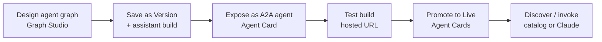

**A2A** (Agent-to-Agent) is how Phinite exposes [agent graphs](/graph-studio/overview) as callable services other agents and clients can discover and invoke over the [A2A protocol](https://a2a-protocol.org/latest/specification/).

The workspace **A2A catalog** (sidebar: **Agent Registry**) stores **Agent Cards** — metadata plus hosted URLs for each registered graph build.

---

## What problem A2A solves

| Without A2A | With A2A |
| --- | --- |
| Agent graphs run only inside one [assistant](/assistants/overview) | Graphs publish as standalone services with a public identity |
| Other workflows cannot discover or call your agent | [Browse](/agent-registry/registry-agent-nodes) or [Discovery](/agent-registry/registry-agent-nodes) attach registry agents on the canvas |
| External tools must integrate per-assistant | Clients like [Claude](/agent-registry/invoke-a2a-from-claude) call hosted endpoints with standard A2A messages |

A2A sits **on top of** what you already build in Phinite — [Graph Studio](/graph-studio/overview), [tools](/devstudio/overview), [builds](/builds/overview), and [environments](/builds/environments).

---

## Core concepts

| Concept | In Phinite | Learn more |
| --- | --- | --- |
| **Agent graph** | Visual workflow you design and [publish](/graph-studio/publishing) | [Graph Studio](/graph-studio/overview) |
| **Agent Card** | Public identity — name, description, skills, tags, visibility | [Expose wizard](/agent-registry/expose-your-flow) |
| **Registry build** | One expose action → one **test** or **live** deployment | [Deployment & visibility](/agent-registry/deployment-and-visibility) |
| **Hosted A2A URL** | HTTP endpoint external callers use | [Endpoints & lifecycle](/agent-registry/endpoints-and-lifecycle) |
| **Browse mode** | Master [agent node](/graph-studio/agent-node) calls a **specific** registry agent | [Registry agent nodes](/agent-registry/registry-agent-nodes) |
| **Discovery mode** | Master agent **auto-selects** agents matching filters at runtime | [Registry agent nodes](/agent-registry/registry-agent-nodes) |

Full terminology map: **[A2A glossary](/agent-registry/glossary)**. For **test vs live** and **public vs org**, see **[Deployment & visibility](/agent-registry/deployment-and-visibility)**.

---

## Choose your path

<CardGroup cols={3}>
  <Card title="Publish journey" icon="route" href="/agent-registry/publish-journey">
    **Builders** — end-to-end checklist from graph to org-live or public-live.
  </Card>
  <Card title="Compose on canvas" icon="share-nodes" href="/agent-registry/registry-agent-nodes">
    **Architects** — attach registry agents to a master node (Browse or Discovery).
  </Card>
  <Card title="Call from Claude" icon="plug" href="/agent-registry/invoke-a2a-from-claude">
    **End users** — discover and invoke agents via the Phinite Connector.
  </Card>
</CardGroup>

---

## End-to-end workflow (builders)

| Step | Where in Phinite | Doc |
| --- | --- | --- |
| 0. Decide visibility | Public vs Organisation — see matrix | [Deployment & visibility](/agent-registry/deployment-and-visibility) |
| 1. Design | [Graph Studio](/graph-studio/overview) — [agent nodes](/graph-studio/agent-node), [tools](/graph-studio/agent-node/tools), [RAG](/graph-studio/agent-node/rag) | [Publishing](/graph-studio/publishing) |
| 2. Version tools & graph | **Save as Version** on graphs and [DevStudio tools](/devstudio/versioning) | [Builds](/builds/overview) |
| 3. Expose | Graph Studio → **Configure Agent** → **Expose as External Agent** (sets visibility; creates **test**) | [Expose your graph](/agent-registry/expose-your-flow) |
| 4. Validate | Call the **test** hosted URL; check skills and integrations | [Publish journey — Phase 4](/agent-registry/publish-journey#phase-4--validate-the-test-build) |
| 5. Promote | **Agent Cards** → **Push To Prod** (one **live** build per graph per workspace) | [Agent Cards](/agent-registry/agent-cards) |
| 6. Consume | Workspace [catalog](/agent-registry/catalog), canvas Browse/Discovery, or [Claude](/agent-registry/invoke-a2a-from-claude) | [Publish journey — Phase 6–7](/agent-registry/publish-journey#phase-6--verify-your-target-state) |

<Note>
  **Test** vs **live** and **public** vs **organisation** are independent — see **[Deployment & visibility](/agent-registry/deployment-and-visibility)**. **Public + Live** requires Public at expose and Push To Prod for live.
</Note>

---

## How A2A connects to the rest of Phinite

| Platform area | Relationship to A2A |
| --- | --- |
| **[Assistants](/assistants/overview)** | Each exposed graph belongs to an assistant project; assistant [builds](/builds/lifecycle) gate what runs in each environment |
| **[Tools](/devstudio/overview)** | Graph tools must be **versioned** before expose; optional export of [predefined tools](/integrations-hub/predefined-tools/workflow), [MCP](/workspaces/mcp-server), and [env variables](/assistants/components/environments) into the registry build |
| **[Master agent node](/graph-studio/nodes/master-node)** | Orchestrates tasks; registry child nodes call external A2A agents |
| **[Workspace API keys](/workspaces/workspace-overview)** | Authenticate A2A calls (`X-API-Key`); required for Discovery node configuration |
| **[Observability](/observability/overview)** | Debug agent sessions started via A2A like any other run |

---

## Access and permissions

<Warning>
**Configure Agent** in Graph Studio and the full expose wizard are available in **local/dev** environments (`NEXT_PUBLIC_APP_ENV` is `local` or `dev`). Confirm rollout with your administrator for other environments.
</Warning>

| Need | Permission / route |
| --- | --- |
| Open A2A catalog sidebar | `workspace.sidebar.agent_registry` |
| Expose / create registry row | `assistants.flows:create` |
| Promote to live | `assistants.flows:update` |
| Save graphs with registry nodes | `flow_gen.studio.save_flow` |

**Routes:**
- Workspace catalog: `/{org}/workspace/{workspaceId}/agent-registry`
- Project builds: `/{org}/workspace/{workspaceId}/projects/{projectId}/agent-cards`
- Expose entry: Graph Studio → **Configure Agent**

---

## Next steps by role

### Builders & developers
- [End-to-end publish journey](/agent-registry/publish-journey)
- [Deployment & visibility](/agent-registry/deployment-and-visibility)
- [Expose your agent graph](/agent-registry/expose-your-flow)
- [Agent Cards & builds](/agent-registry/agent-cards)
- [A2A endpoints & lifecycle](/agent-registry/endpoints-and-lifecycle)

### Architects composing multi-agent flows
- [Registry agent nodes — Browse & Discovery](/agent-registry/registry-agent-nodes)
- [Browse the A2A catalog](/agent-registry/catalog)
- [Master agent node](/graph-studio/nodes/master-node)

### End users & integrators
- [Invoke A2A agents from Claude](/agent-registry/invoke-a2a-from-claude)
- [API reference](/reference/api)
- [A2A glossary](/agent-registry/glossary)
