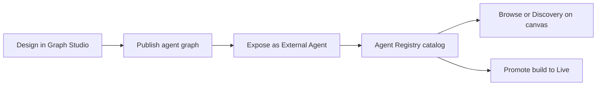

<Frame>
  
  
</Frame>

## What the Agent Registry is

The **Agent Registry** is your workspace catalog of **Agent Cards**—registered metadata and hosted endpoints for agent graphs you expose over the [**Agent-to-Agent (A2A) protocol**](https://a2a-protocol.org/latest/specification/). Each registry entry ties a published **agent graph build** to skills, discoverability tags, visibility, and a **hosted A2A URL** that external systems and other agents can call.

Use Agent Registry when you want to:

- **Publish** an agent graph as a callable A2A service (not only run it inside a single assistant).
- **Discover** agents across your organisation—or, when visibility is public, from compatible clients with a valid API key.
- **Compose** multi-agent workflows by attaching registry agents to a **master agent node** in **Browse** or **Discovery** mode.
- **Call** registry agents from **Claude** using the [Phinite Connector](/agent-registry/invoke-a2a-from-claude) (`discover_agents`, `call_agent`, and credential setup).

## End-to-end workflow

| Step | Where | Outcome |
| --- | --- | --- |
| 1. Design | [Graph Studio](/graph-studio/overview) | Agent graph with prompts, tools, and routing |
| 2. Publish | [Publishing](/graph-studio/publishing) | Versioned build ready to expose |
| 3. Expose | [Expose your flow](/agent-registry/expose-your-flow) | Agent Card \+ registry ID \+ **test** hosted URL |
| 4. Browse | [Agent Registry catalog](/agent-registry/catalog) | Search, filter, inspect skills and endpoints |
| 5. Compose | [Registry agent nodes](/agent-registry/registry-agent-nodes) | Call a specific agent (**Browse**) or auto-match filters (**Discovery**) |
| 6. Promote | [Agent Cards](/agent-registry/agent-cards) | One **live** build per agent graph per workspace |

## Access and environment

<Warning>
  Agent Registry sidebar entry, **Configure Agent** in Graph Studio, and related expose flows are available when the app runs in a **local or dev** environment (`NEXT_PUBLIC_APP_ENV` is `local` or `dev`, or `NODE_ENV` is `development`). Production rollout may differ—confirm with your administrator.
</Warning>

**Sidebar permission:** `workspace.sidebar.agent_registry` (legacy alias `workspace.sidebar:agent_registry`).

**Routes:**

- Workspace catalog: `/{organisation}/workspace/{workspaceId}/agent-registry`
- Project Agent Cards (builds): `/{organisation}/workspace/{workspaceId}/projects/{projectId}/agent-cards`
- Graph Studio (expose entry): `.../projects/{projectId}/studio`

## Terminology

Phinite maps industry A2A vocabulary to product labels as follows:

| Industry / A2A term | Phinite UI / API | Meaning |
| --- | --- | --- |
| **Agent Card** | Agent Card (wizard step 3) | Public identity: name, description, skills, tags, visibility |
| **Agent Registry** | Agent Registry sidebar | Workspace catalog of registered A2A agents |
| **A2A endpoint / Hosted agent URL** | `/api/v1/ai/a2a/{flowId}` or `.../{registryId}` | Callable agent over the A2A protocol |
| **Skills** | Skills in wizard | Callable capabilities with input/output MIME modes |
| **Discoverability tags** | Discoverability Tags | Metadata for search and Discovery filters |
| **Deployment status** | Test / Live badges | `test` = validation build; `live` = production (one live per flow per workspace) |
| **Visibility** | Public / Organisation | `public` = any A2A client with a valid API key; `organization` = same organisation only |
| **Browse mode** | Browse tab on agent node | Master agent calls a **specific** registry agent |
| **Discovery mode** | Discovery tab on agent node | Master agent **auto-selects** agents matching saved filters at runtime |

Some canvas labels still say **Agent Block** (for example in the browse panel); documentation uses **Agent Node** as the preferred term. See the [**Agent Registry glossary**](/agent-registry/glossary) for MIME modes and API field names.

## Next steps

<CardGroup cols={2}>
  <Card title="Invoke from Claude" icon="plug" href="/agent-registry/invoke-a2a-from-claude">
    Install the Phinite Connector, discover agents, and run tasks from Claude.
  </Card>

  <Card title="Expose an agent" icon="rocket" href="/agent-registry/expose-your-flow">
    Register an agent graph with the three-step Expose wizard.
  </Card>

  <Card title="Registry agent nodes" icon="share-nodes" href="/agent-registry/registry-agent-nodes">
    Browse vs Discovery on the Graph Studio canvas.
  </Card>

  <Card title="Browse the catalog" icon="layout-grid" href="/agent-registry/catalog">
    Search, filter, and inspect registry entries.
  </Card>

  <Card title="Agent Cards & builds" icon="layers" href="/agent-registry/agent-cards">
    Manage test and live builds; push to production.
  </Card>

  <Card title="Endpoints & lifecycle" icon="plug" href="/agent-registry/endpoints-and-lifecycle">
    Hosted URL patterns, auth, and promote-live.
  </Card>

  <Card title="Glossary" icon="book-open" href="/agent-registry/glossary">
    Industry terms, MIME modes, and UI label mapping.
  </Card>
</CardGroup>