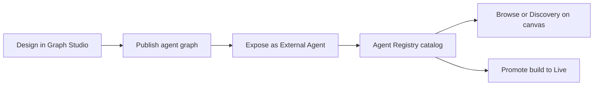

## What the Agent Registry is

The **Agent Registry** is your workspace catalog of **Agent Cards**—registered metadata and hosted endpoints for agent graphs you expose over the **[Agent-to-Agent (A2A) protocol](https://a2a-protocol.org/latest/specification/)**. Each registry entry ties a published **agent graph build** to skills, discoverability tags, visibility, and a **hosted A2A URL** that external systems and other agents can call.

Use Agent Registry when you want to:

- **Publish** an agent graph as a callable A2A service (not only run it inside a single assistant).
- **Discover** agents across your organisation—or, when visibility is public, from compatible clients with a valid API key.
- **Compose** multi-agent workflows by attaching registry agents to a **master agent node** in **Browse** or **Discovery** mode.
- **Call** registry agents from **Claude** using the [Phinite Connector](/agent-registry/invoke-a2a-from-claude) (`discover_agents`, `call_agent`, and credential setup).

## End-to-end workflow

| Step | Where | Outcome |
| ---- | ----- | ------- |
| 1. Design | [Graph Studio](/graph-studio/overview) | Agent graph with prompts, tools, and routing |
| 2. Publish | [Publishing](/graph-studio/publishing) | Versioned build ready to expose |
| 3. Expose | [Expose wizard](/agent-registry/publish#expose-wizard) | Agent Card + registry ID + **test** hosted URL |
| 4. Browse | [Browse the catalog](/agent-registry/compose#catalog) | Search, filter, inspect skills and endpoints |
| 5. Compose | [Registry agent nodes](/agent-registry/compose#registry-agent-nodes) | Call a specific agent (**Browse**) or auto-match filters (**Discovery**) |
| 6. Promote | [Agent Cards and builds](/agent-registry/publish#agent-cards-and-builds) | One **live** build per agent graph per workspace |

## Access and environment

<Warning>
Agent Registry sidebar entry, **Configure Agent** in Graph Studio, and related expose flows are available when the app runs in a **local or dev** environment (`NEXT_PUBLIC_APP_ENV` is `local` or `dev`, or `NODE_ENV` is `development`). Production rollout may differ—confirm with your administrator.
</Warning>

**Sidebar permission:** `workspace.sidebar.agent_registry` (legacy alias `workspace.sidebar:agent_registry`).

**Routes:**

- Workspace catalog: `/{organisation}/workspace/{workspaceId}/agent-registry`
- Project Agent Cards (builds): `/{organisation}/workspace/{workspaceId}/projects/{projectId}/agent-cards`
- Graph Studio (expose entry): `.../projects/{projectId}/studio`

## Terminology
This section aligns **Agent-to-Agent (A2A)** vocabulary with what you see in Graph Studio, Agent Registry, and the gateway. For protocol details beyond Phinite, see the official **[A2A protocol specification](https://a2a-protocol.org/latest/specification/)**.

### Industry terminology map

| Industry / A2A term | Phinite UI / API | Meaning |
| ------------------- | ---------------- | ------- |
| **Agent Card** | Agent Card (wizard step 3) | Public identity: name, description, skills, tags, visibility |
| **Agent Registry** | Agent Registry sidebar | Workspace catalog of registered A2A agents |
| **A2A endpoint / Hosted agent URL** | `/api/v1/ai/a2a/{flowId}` or `.../{registryId}` | Callable agent over the Agent-to-Agent protocol |
| **Skills** | Skills in wizard | Callable capabilities with input/output MIME modes |
| **Discoverability tags** | Discoverability Tags | Metadata for search and Discovery filters |
| **Deployment status** | Test / Live badges | `test` = validation build; `live` = production (one live per flow per workspace) |
| **Visibility** | Public / Organisation | `public` = any A2A client with a valid API key; `organization` = same organisation only |
| **Promote to Live** | Agent Cards / promote action | `PUT .../promote-live` — demotes other live builds for the same flow |
| **Browse mode** | Browse tab on agent node | Master agent calls a **specific** registry agent |
| **Discovery mode** | Discovery tab on agent node | Master agent **auto-selects** agents matching saved filters at runtime |
| **Agent Graph** | Flow | The workflow backing the registered agent |

### Phinite Connector (Claude)

Terms used when calling registry agents from Claude via the [Phinite Connector](/agent-registry/invoke-a2a-from-claude):

| Term | Meaning |
| ---- | ------- |
| **Phinite Connector** | Claude plugin that authenticates to Phinite and exposes registry tools |
| **`list_agents`** | Returns up to 50 published agents in your organisation (unfiltered browse) |
| **`discover_agents`** | Natural-language search over agent name, description, and skills; optional `status` (`live` / `test`) and `limit` |
| **`call_agent`** | Sends a message to an agent by `registry_id`; optional `task_id` for multi-turn context |
| **`task_id`** | A2A task identifier returned on first `call_agent` response; pass on follow-ups to continue the same conversation |
| **Credential setup link** | URL to `/public/agent-config` when an agent needs integration credentials before running |

### UI labels vs documentation terms

| Product UI label | Preferred docs term | Where it appears |
| ---------------- | ------------------- | ---------------- |
| **Agent Block** | **Agent Node** | Browse / Discovery panel when attaching registry agents on the canvas |
| **Flow** | **Agent Graph** | Project and Studio navigation (same underlying workflow) |
| **Organisation** | Organisation | Registry filters and Agent Card visibility (British spelling in UI) |

When writing integrations or internal runbooks, prefer **Agent Node** and **Agent Graph** for consistency with **[Graph Studio agent nodes](/graph-studio/agent-node)** documentation.

### MIME input and output modes

Skills and registry filters declare which content types an agent accepts and returns. Phinite supports the following MIME types in Agent Registry filters and skill configuration:

| MIME type | Typical use |
| --------- | ----------- |
| `text/plain` | Plain text messages |
| `text/markdown` | Markdown-formatted text |
| `text/html` | HTML content |
| `application/json` | Structured JSON payloads |
| `application/pdf` | PDF documents |
| `application/octet-stream` | Binary or opaque payloads |
| `image/png`, `image/jpeg`, `image/webp` | Image inputs or outputs |
| `video/mp4` | Video content |
| `audio/mpeg`, `audio/wav`, `audio/ogg`, `audio/aac`, `audio/mp4` | Audio content |

**Input modes** describe what callers may send to a skill; **output modes** describe what the agent may return. Discovery mode on an agent node can filter registry agents by matching input and output MIME modes at runtime.

## Next steps

<CardGroup cols={2}>
<Card title="Invoke from Claude" href="/agent-registry/invoke-a2a-from-claude" icon="plug">
Install the Phinite Connector, discover agents, and run tasks from Claude.
</Card>
<Card title="Publish and endpoints" href="/agent-registry/publish" icon="rocket">
Expose wizard, Agent Cards, hosted URLs, and lifecycle.
</Card>
<Card title="Compose on canvas" href="/agent-registry/compose" icon="share-nodes">
Registry agent nodes and catalog browse.
</Card>
</CardGroup>
