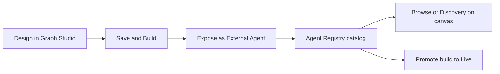

The **Agent Registry** is your workspace catalog of **Agent Cards** — registered metadata and hosted endpoints for Agent Graphs you expose over the [**Agent-to-Agent (A2A) protocol**](https://a2a-protocol.org/latest/specification/). Each registry entry ties a published **Agent Build** to skills, discoverability tags, visibility, and a **hosted A2A URL** that external systems and other agents can call.

<CardGroup cols={2}>
  <Card title="Invoke from Claude" icon="plug" href="/agent-registry/invoke-a2a-from-claude">
    Install the Phinite Connector, discover agents, and run tasks from Claude.
  </Card>
  <Card title="Expose an agent" icon="rocket" href="/agent-registry/expose-your-flow">
    Register an Agent Graph with the three-step Expose wizard.
  </Card>
  <Card title="Registry agent nodes" icon="share-nodes" href="/agent-registry/registry-agent-nodes">
    Browse vs Discovery on the Graph Studio canvas.
  </Card>
  <Card title="Browse the catalog" icon="layout-grid" type="note" href="/agent-registry/catalog">
    Search, filter, and inspect registry entries.
  </Card>
</CardGroup>

<Frame caption="Agent Registry — search, filter, and inspect exposed A2A agents">
  
  
</Frame>

## What the Agent Registry is

Use Agent Registry when you want to:

- **Publish** an Agent Graph as a callable A2A service — not only run it via channels or triggers.
- **Discover** agents across your organisation — or, when visibility is public, from compatible clients with a valid API key.
- **Compose** multi-agent workflows by attaching registry agents to a **Master Agent** node in **Browse** or **Discovery** mode.
- **Call** registry agents from **Claude** using the [Phinite Connector](/agent-registry/invoke-a2a-from-claude) (`discover_agents`, `call_agent`, and credential setup).

## End-to-end workflow

```mermaid
graph LR
  design[Design in Graph Studio]
  publish[Save and Build]
  expose[Expose as External Agent]
  registry[Agent Registry catalog]
  consume[Browse or Discovery on canvas]
  live[Promote build to Live]

  design --> publish --> expose --> registry
  registry --> consume
  registry --> live
```

| Step | Where | Outcome |
| --- | --- | --- |
| 1. Design | [Graph Studio](/graph-studio/overview) | Agent Graph with prompts, tools, and routing |
| 2. Build | [Builds overview](/builds/overview) | Versioned build ready to expose |
| 3. Expose | [Expose your flow](/agent-registry/expose-your-flow) | Agent Card + registry ID + **TEST** hosted URL |
| 4. Browse | [Agent Registry catalog](/agent-registry/catalog) | Search, filter, inspect skills and endpoints |
| 5. Compose | [Registry agent nodes](/agent-registry/registry-agent-nodes) | **Browse** (specific agent) or **Discovery** (filter-based match) |
| 6. Promote | [Agent Cards](/agent-registry/agent-cards) | One **LIVE** build per Agent Graph per workspace |

## Browse the catalog

Open **Agent Registry** from the workspace sidebar (`workspace.sidebar.agent_registry`).

| Area | Description |
| --- | --- |
| Hero | Search across registry entries by name, summary, and tags |
| Filters | Visibility, deployed status, input/output MIME modes, discoverability tags |
| Detail panel | Skills, status, visibility, copyable endpoint URL |

<Frame caption="Registry catalog — filter by visibility, status, and MIME modes">
  
</Frame>

### Filter dimensions

| Filter | Options | Matches |
| --- | --- | --- |
| **Visibility** | Public, Organisation | Agent Card visibility |
| **Deployed** | Live, Test | Build status |
| **Input / Output Mode** | MIME types | Skill compatibility |
| **Tags** | Discoverability tags | Topic / capability |

1. Open **Agent Registry** from the workspace sidebar.
2. Search or apply filters to narrow agents.
3. Select an agent to view **Agent Card** details and hosted URL.
4. Use **TEST** URLs for validation; **LIVE** URL after [Push to Prod](/agent-registry/agent-cards).

## Compose with registry agent nodes

**Registry agent nodes** let a **Master Agent** call other exposed A2A agents from your organisation or public catalog.

| Mode | Use when | Runtime behavior |
| --- | --- | --- |
| **Browse** | You know which agent to call | Invokes one selected registration (`a2aregistryid`) |
| **Discovery** | The right agent depends on context | Master agent matches agents using saved filters at runtime |

<Frame caption="Browse and Discovery — attach registry agents on the canvas">
  
</Frame>

### Attach via Browse

1. Open **Graph Studio** and select a **Master Agent** node.
2. Add or select an unconfigured **agent** node beneath it.
3. Open the **Browse** panel.
4. Search and filter agents (same dimensions as the catalog).
5. Select an agent card and review preview (hosted URL, skills, build status).
6. Add to canvas; configure exported **tools** and **env** in the **Configuration** sub-view.
7. **Save** — node stores `agent_node_type: "browse"` and `a2aregistryid`.

### Attach via Discovery

1. From the registry panel, switch to **Discovery** mode.
2. Set filters: Visibility, Deployed (Live/Test), Input/Output MIME modes, Tags, Auth.
3. Click **Save Filters** — creates a **Discovery Agent** node.
4. Configure Discovery **API key** if prompted.
5. **Save** the graph.

<Note>
  In Discovery mode, the Master Agent finds and attaches agents automatically based on saved filter criteria at runtime.
</Note>

## Access and environment

<Warning>
  Agent Registry sidebar entry, **Configure Agent** in Graph Studio, and related expose flows are available when the app runs in a **local or dev** environment (`NEXT_PUBLIC_APP_ENV` is `local` or `dev`, or `NODE_ENV` is `development`). Production rollout may differ — confirm with your administrator.
</Warning>

**Routes:**

- Workspace catalog: `/{organisation}/workspace/{workspaceId}/agent-registry`
- Project Agent Cards (builds): `/{organisation}/workspace/{workspaceId}/projects/{projectId}/agent-cards`
- Graph Studio (expose entry): `.../projects/{projectId}/studio`

## Terminology

Phinite maps industry A2A vocabulary to product labels as follows:

| Industry / A2A term | Phinite UI / API | Meaning |
| --- | --- | --- |
| **Agent Card** | Agent Card (wizard step 3) | Public identity: name, description, skills, tags, visibility |
| **Agent Registry** | Agent Registry sidebar | Workspace catalog of registered A2A agents |
| **A2A endpoint / Hosted agent URL** | `/api/v1/ai/a2a/{flowId}` or `.../{registryId}` | Callable agent over the A2A protocol |
| **Skills** | Skills in wizard | Callable capabilities with input/output MIME modes |
| **Discoverability tags** | Discoverability Tags | Metadata for search and Discovery filters |
| **Deployment status** | Test / Live badges | `test` = validation build; `live` = production (one live per graph per workspace) |
| **Visibility** | Public / Organisation | `public` = any A2A client with a valid API key; `organization` = same organisation only |
| **Browse mode** | Browse tab on agent node | Master agent calls a **specific** registry agent |
| **Discovery mode** | Discovery tab on agent node | Master agent **auto-selects** agents matching saved filters at runtime |

Some canvas labels still say **Agent Block** (for example in the browse panel); documentation uses **Agent Node** as the preferred term. See the [Agent Registry glossary](/agent-registry/glossary) for MIME modes and API field names.

## Next steps

<CardGroup cols={2}>
  <Card title="Agent Cards & builds" icon="layers" href="/agent-registry/agent-cards">
    Manage test and live builds; push to production.
  </Card>
  <Card title="Endpoints & lifecycle" icon="link" href="/agent-registry/endpoints-and-lifecycle">
    Hosted URL patterns, auth, and promote-live.
  </Card>
  <Card title="Glossary" icon="book-open" href="/agent-registry/glossary">
    Industry terms, MIME modes, and UI label mapping.
  </Card>
  <Card title="Deploy as A2A" icon="paper-plane" type="tip" href="/agents/deploy">
    Expose entry point from Graph Studio Deploy dialog.
  </Card>
</CardGroup>
