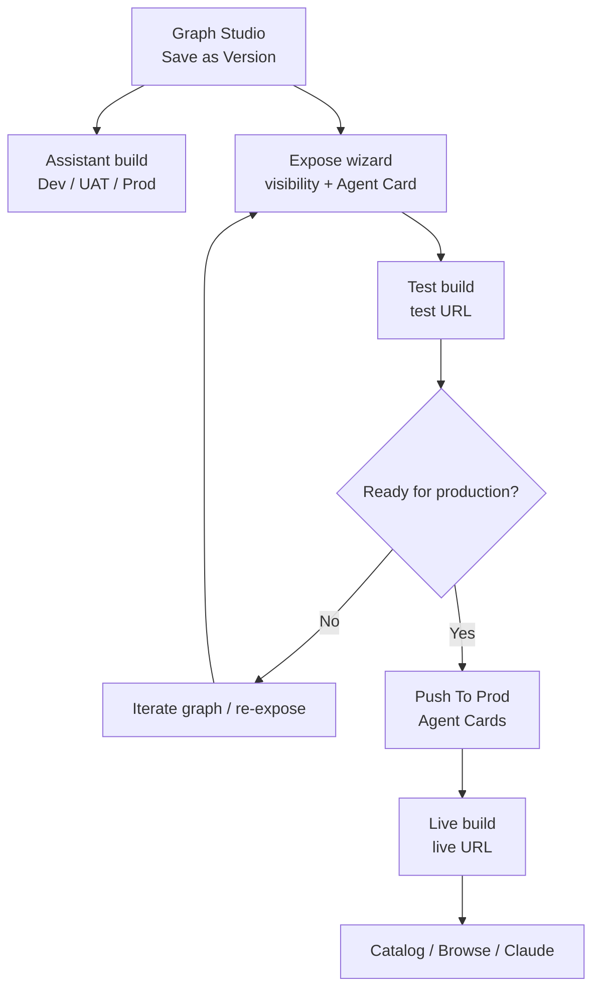

Use this page as a single runbook for publishing an A2A agent. For the two-axis model (**test/live** × **public/org**), read **[Deployment & visibility](/agent-registry/deployment-and-visibility)** first.

---

## Before you start

Decide your target state:

| Target | Visibility (expose step 3) | Deployment (after promote) |
| ------ | -------------------------- | -------------------------- |
| **Org-internal production** | Organisation | Live |
| **Public / cross-org production** | **Public** | **Live** |
| **Validation only** | Either | Test (skip promote) |

---

## Phase 1 — Build the agent graph

- [ ] Create or open an [assistant](/assistants/overview) (conversational or voice for typical A2A expose).
- [ ] Design the graph in [Graph Studio](/graph-studio/overview) — [agent nodes](/graph-studio/agent-node), [tools](/graph-studio/agent-node/tools), optional [master node](/graph-studio/nodes/master-node) for multi-agent orchestration.
- [ ] **Save as Version** on the agent graph. See [Graph Studio publishing](/graph-studio/publishing).
- [ ] **Save as Version** on every [DevStudio tool](/devstudio/versioning) linked from the graph.

---

## Phase 2 — Deploy assistant runtime (parallel)

Expose registers the graph for A2A; the assistant still needs normal [builds](/builds/overview) if the graph runs in-product (intents, [channels](/integrations-hub/channels/overview), etc.).

- [ ] Build and deploy the assistant to the target [environment](/builds/environments) (Dev → UAT → Prod as your process requires).
- [ ] Confirm the graph version you will expose matches what runs in that environment.

<Note>
**A2A live ≠ assistant Prod build.** Both should align before you promote A2A to live, but they are separate actions.
</Note>

---

## Phase 3 — Register in A2A (always **test**)

- [ ] Open Graph Studio → **Configure Agent** (available in local/dev environments — see [Overview — Access](/agent-registry/overview#access-and-permissions)).
- [ ] **Expose as External Agent** → **Create New Build**.
- [ ] **Step 1** — Select agent graph version and versioned tools.
- [ ] **Step 2** — Optionally export [predefined tools](/integrations-hub/predefined-tools/workflow), [MCP](/workspaces/mcp-server), or [env variables](/assistants/components/environments).
- [ ] **Step 3** — Configure Agent Card: skills, tags, and **Visibility & access** (**Public** or **Organisation**).
- [ ] Submit → note **registry ID** and **test hosted URL**.

Full wizard reference: **[Expose your agent graph](/agent-registry/expose-your-flow)**

---

## Phase 4 — Validate the **test** build

- [ ] Call the **test** URL with your org [API key](/workspaces/workspace-overview) (`X-API-Key`).
- [ ] Verify skills, responses, and tool behaviour match the Agent Card.
- [ ] If integrations are required, complete credential setup when the runtime returns `TASK_STATE_AUTH_REQUIRED` (link to `/public/agent-config`).
- [ ] Check [Observability logs](/observability/logs) for the session.
- [ ] In the workspace catalog, filter **Deployed: Test** and confirm the build appears under your org.

URL and auth details: **[Endpoints & lifecycle](/agent-registry/endpoints-and-lifecycle)**

---

## Phase 5 — Promote to **live**

Skip this phase if you only need test validation.

- [ ] Open project **Agent Cards** (`.../projects/{projectId}/agent-cards`) or Graph Studio → **See Agent builds**.
- [ ] Select the test build → **Push To Prod** → confirm.
- [ ] Verify the row shows **LIVE** and the **live** hosted URL (no registry ID in the path).
- [ ] Confirm the previous live build for the same graph (if any) was demoted to **test**.

Promotion rules: **[Agent Cards & builds](/agent-registry/agent-cards)**

<Warning>
Promotion updates **deployment status only**. It does **not** change **Public** vs **Organisation**. Set visibility correctly in phase 3.
</Warning>

---

## Phase 6 — Verify your target state

### Org + Live

- [ ] Catalog filters: **Visibility: Organisation**, **Deployed: Live**.
- [ ] Live URL responds with org API key; other orgs cannot invoke (unless visibility were Public).
- [ ] Optional: attach via [Browse](/agent-registry/registry-agent-nodes) on a master agent node.

### Public + Live

- [ ] Catalog filters: **Visibility: Public**, **Deployed: Live**.
- [ ] Live URL responds with any valid Phinite API key (per your deployment's auth rules).
- [ ] For external discovery: test [Claude Connector](/agent-registry/invoke-a2a-from-claude) `discover_agents` with `status=live`.
- [ ] Confirm other orgs can discover the agent (public + live only).

Catalog reference: **[Browse the A2A catalog](/agent-registry/catalog)**

---

## Phase 7 — Consume

| Use case | Where to go |
| -------- | ----------- |
| Search and inspect agents | [A2A catalog](/agent-registry/catalog) |
| Fixed agent on a master node | [Browse mode](/agent-registry/registry-agent-nodes) |
| Runtime agent selection by filters | [Discovery mode](/agent-registry/registry-agent-nodes) |
| Call from Claude | [Invoke from Claude](/agent-registry/invoke-a2a-from-claude) |
| Direct HTTP / integrators | [Endpoints & lifecycle](/agent-registry/endpoints-and-lifecycle), [API reference](/reference/api) |

---

## Quick reference diagram

---

## Related pages

<CardGroup cols={2}>
  <Card title="Deployment & visibility" href="/agent-registry/deployment-and-visibility" icon="sliders">
    Test/live × public/org matrix and catalog rules.
  </Card>
  <Card title="A2A overview" href="/agent-registry/overview" icon="share-nodes">
    Personas, permissions, and platform connections.
  </Card>
</CardGroup>
