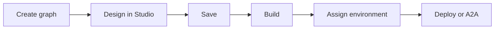

An **Agent Graph** is the unit you create and open from **Workspace Home**. Every graph follows the golden path: **Design → Save → Build → Environment → Deploy** (or **Expose as A2A**).

<CardGroup cols={2}>
  <Card title="Conversational" icon="comments" href="/agents/conversational">
    Voice and chat agents — deploy to channels or Chat API.
  </Card>
  <Card title="Autonomous" icon="robot" href="/agents/autonomous">
    Background automation — API triggers and cron schedules.
  </Card>
  <Card title="Graph Studio" icon="pencil" href="/graph-studio/overview">
    Design nodes, tools, RAG, and variables on the canvas.
  </Card>
  <Card title="Quickstart" icon="rocket" type="tip" href="/getting-started/quickstart">
    First graph from empty workspace to deployable build.
  </Card>
</CardGroup>

## Graph types

| Type | Role | Typical deploy targets |
| --- | --- | --- |
| **Conversational** | Real-time voice and chat with users | Channel, Chat API, A2A |
| **Autonomous** | Background tasks without a live user | API trigger, Cron, A2A (coming soon) |

## Create an Agent Graph

1. Open **Workspace Home**.
2. Click **New Agent Graph**.
3. Enter **Agent Graph Name** and **Description**.
4. Choose **Conversational** or **Autonomous**.
5. Click **Create Agent Graph** — Graph Studio opens on the canvas.

<Frame caption="New Agent Graph — type picker and name fields">
  
</Frame>

<Note>
  Workspace filters may still show an **Email** chip. New graphs only offer **Conversational** and **Autonomous**.
</Note>

## Lifecycle at a glance

| Stage | Where | Outcome |
| --- | --- | --- |
| **Design** | [Graph Studio](/graph-studio/overview) | Nodes, tools, RAG, variables |
| **Save** | Studio toolbar | Persisted draft graph |
| **Build** | Studio **Build** dialog | Immutable build with pinned tool versions |
| **Environment** | Build assignment drawer | DEV / UAT / PROD |
| **Deploy** | Studio **Deploy** dialog | Channel, Chat API, trigger, or A2A |

<Tip>
  You can change graph type later from graph settings, but deploy targets differ — review [Deploy](/agents/deploy) before switching in production.
</Tip>

## Choose the right type

| Choose **Conversational** when… | Choose **Autonomous** when… |
| --- | --- |
| Users interact in real time via chat or voice | Work runs on a schedule or external webhook |
| You need channel or Chat API ingress | No live user session is required |
| Multi-turn dialogue drives the flow | Batch, monitoring, or pipeline logic |

## Related

- [Conversational Agent Graphs](/agents/conversational)
- [Autonomous Agent Graphs](/agents/autonomous)
- [Builds overview](/builds/overview)
- [Deploy](/agents/deploy)
- [Glossary](/reference/glossary-v2)
