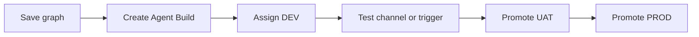

The **build lifecycle** tracks how an Agent Graph moves from active design to a frozen **Agent Build** running in a target **environment**.

<Note>
  A build is immutable once created. To ship graph or tool changes, create a **new build** and reassign deploy targets — do not edit an existing build snapshot.
</Note>

## Lifecycle stages

| Stage | What it means | Where in the product |
| --- | --- | --- |
| **Draft graph** | Active design on the canvas; not yet built | Graph Studio — **Save** persists versions |
| **Validated** | Graph passes build-time checks | **Build** dialog prep step |
| **Agent Build created** | Graph + tool versions pinned | Studio → **Agent Builds** |
| **Environment assigned** | Build mapped to DEV / UAT / PROD | **Deploy**, channel/trigger config, env assign drawer |
| **Deployed** | Runtime serves that build for the environment | Channel webhooks, trigger URLs, A2A hosted URL |

## End-to-end workflow

1. Design and **Save** the Agent Graph in [Graph Studio](/graph-studio/overview).
2. Click **Build** — confirm graph and tool versions ([Builds overview](/builds/overview)).
3. Configure **Env. variables** for DEV ([Environments](/builds/environments)).
4. **Deploy** or assign the build to **DEV** ([Deploy](/agents/deploy)).
5. Run smoke tests — channel messages, trigger webhooks, or A2A TEST URL.
6. Promote the same build assignment to **UAT**, then **PROD**, when stakeholders sign off.
7. For A2A: promote Agent Card **TEST** → **LIVE** via [Agent Cards](/agent-registry/agent-cards).

## Promotion rules

- **Channels and triggers**: each integration exposes separate webhook URLs per environment. Update provider config when switching from DEV to PROD URLs.
- **A2A**: only one **LIVE** build per Agent Graph per workspace. **Push To Prod** demotes the previous LIVE row to TEST.
- **Rollback**: assign an older build row to the environment or promote a prior TEST A2A build to LIVE.

<Warning>
  Production deploys may require **Admin** or **SuperAdmin** role depending on workspace policy. Validate in DEV and UAT first.
</Warning>

## Related

- [Builds overview](/builds/overview)
- [Publishing](/builds/publishing)
- [Build environments](/builds/environments)
- [Observability logs](/observability/logs)
