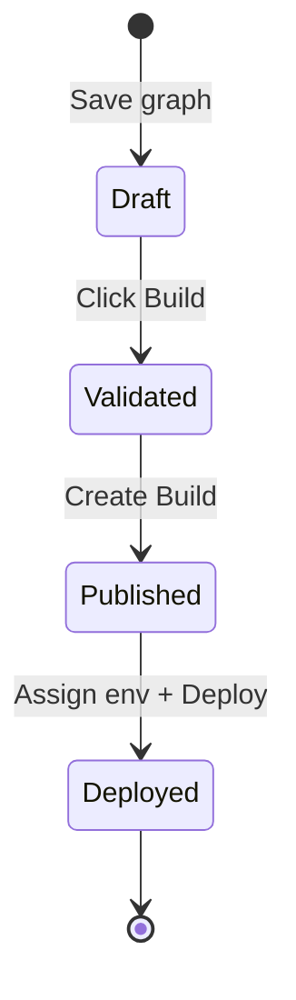

A **Build** is an immutable snapshot of your Agent Graph and pinned tool versions — the artifact you assign to environments and deploy to channels, triggers, or A2A.

<CardGroup cols={2}>
  <Card title="Build lifecycle" icon="rotate" href="/builds/lifecycle">
    Draft → validated → published → deployed.
  </Card>
  <Card title="Publishing" icon="upload" href="/builds/publishing">
    Publish tools and graph versions before building.
  </Card>
  <Card title="Environments" icon="server" href="/builds/environments">
    DEV, UAT, and PROD assignment.
  </Card>
  <Card title="Deploy" icon="paper-plane" type="tip" href="/agents/deploy">
    Channel, Chat API, trigger, or A2A targets.
  </Card>
</CardGroup>

## What is a build?

| Property | Detail |
| --- | --- |
| **Immutable** | Graph structure + pinned tool versions frozen at creation time |
| **Versioned** | Each build gets a description and version label |
| **Environment-scoped** | Assigned to DEV, UAT, or PROD independently |
| **Deploy prerequisite** | Deploy and Expose as A2A require at least one build |

<Frame caption="Build dialog — confirm Agent Graph version and pinned tools">
  
</Frame>

## Create a build

1. In Graph Studio, **Save** the graph.
2. Click **Build** on the toolbar.
3. Wait while Phinite validates the graph and packages tool versions.
4. Add a **Description**.
5. Confirm **Agent Graph** version and **Tools** — click **Publish** on any unpublished tool.
6. Click **Create Build**.

Builds appear under Studio sidebar → **Agent Builds**.

<Note>
  **Build** stays disabled until the graph is saved. Unpublished tools block build creation until you publish them from **Dev Studio**.
</Note>

## Build lifecycle

| Stage | Meaning |
| --- | --- |
| **Draft** | Saved graph — editable on canvas |
| **Validated** | Build dialog checks graph and tool readiness |
| **Published** | Build artifact created with pinned versions |
| **Deployed** | Build assigned to environment and wired to channel/trigger/A2A |

See [Build lifecycle](/builds/lifecycle) for detailed transitions.

## Assign to environments

1. Open **Agent Builds** in Graph Studio sidebar or the build list.
2. Select a build and open the **Assign environment** drawer.
3. Choose **DEV**, **UAT**, or **PROD**.
4. Confirm — the build becomes active for that environment.

Each environment reads its own [env variables](/configure/env-variables) and integration credentials at runtime.

<Tip>
  Promote builds DEV → UAT → PROD after testing. Never edit a deployed build — create a new build from an updated graph instead.
</Tip>

## Builds vs Agent Cards

| Artifact | Purpose |
| --- | --- |
| **Agent Build** | Runtime package for channel, Chat API, and trigger deploy |
| **Agent Card** | A2A identity (skills, tags, visibility) tied to a build |

Agent Cards reference a build when you [Expose as A2A](/agent-registry/expose-your-flow). See [Agent Cards & builds](/agent-registry/agent-cards).

## Related

- [Build configuration](/builds/configuration)
- [Environments](/builds/environments)
- [Publishing](/builds/publishing)
- [Configure overview](/configure/overview)
- [Quickstart](/getting-started/quickstart)
