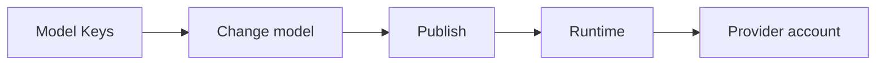

**Model Keys** is where you manage LLM provider credentials for your workspace. Each agent node in Graph Studio can use the built-in **Phinite Key** or a credential you add—called a Model Provider Key. Bring Your Own Key (BYOK) is the name for that capability.

You add keys once on the **Model Keys** page, then choose which key a node uses when you open **Change model** in Graph Studio.

## Prerequisites

Before you use BYOK in production:

- Confirm your organisation is on **Professional**, **Growth**, or **Enterprise**. BYOK is not available on Free or Builder plans.
- Hold a role with read access to **Model Keys**, and edit access to **Graph Studio** agent nodes.

## Model Keys vs workspace API keys

These two secret types serve different directions. Do not mix them.

| | Model Keys | Workspace API keys |
| --- | --- | --- |
| What they do | Authenticate Phinite to **model providers** (outbound) | Authenticate **callers** to Phinite (inbound) |
| Found in sidebar | **Model Keys** | **API Keys** |
| Used for | LLM inference on agent nodes | Triggers, external apps, Agent Registry |

<Warning>
Do not paste workspace API keys into **Model Keys**, or model provider keys into **API Keys**. They have different permissions and rotation requirements.
</Warning>

## Phinite Key vs a custom Model Provider Key

Every workspace has a **Phinite Key** card on the **Model Keys** page. It is marked **Built-in**. You do not enter a secret for it—Phinite manages the credentials.

A custom **Model Provider Key** is a named credential for one provider (Azure, Google Vertex, and others). You enter the credential, Phinite encrypts it, and the list masks it. Authorized roles can view, edit, or copy a key from the card.

To use the Phinite Key on a node, leave **Bring your own key(BYOK)** off in **Change model**. To use your key, turn it on and select the key.

<Info>
Open the info icon next to **Model Keys** in the sidebar for the in-product description, including Anthropic, Azure, and Gemini examples.
</Info>

## End-to-end workflow

<Steps>
<Step title="Add keys on the Model Keys page">
Open [Managing Model Keys](/byok-v2/managing-model-keys). Create the provider credentials your agent graphs will need and optionally set a workspace default.
</Step>
<Step title="Configure each agent node">
In Graph Studio, open [Change model](/byok-v2/graph-studio-byok) on each agent node. Set **Resource**, **Operation**, **Model**, and whether to use **Phinite Key** or your key.
</Step>
<Step title="Publish the agent graph">
Follow [Agent Graph publishing](/graph-studio/publishing). The published build stores a key reference, not the plaintext credential.
</Step>
<Step title="Monitor usage and billing">
Phinite decrypts and uses the key at runtime. Check [Billing with BYOK](/byok-v2/billing-and-usage) to understand how own-key inference appears in usage.
</Step>
</Steps>

## Access requirements

BYOK (`features.byok`) is available on Professional, Growth, and Enterprise plans. Free and Builder plans do not include it.

| Requirement | Value |
| --- | --- |
| Model Keys UI | `workspace.api_keys` (read, create, and update as needed) |
| Sidebar visibility | `workspace.sidebar.api_keys` |
| BYOK API | `workspace.byok` |

Plan checkout lists **BYOK (Bring Your Own Keys)**. If **Model Keys** or the BYOK toggle is absent, confirm the active plan under organisation **Billing**.

## Related pages

<CardGroup cols={2}>
<Card title="Managing Model Keys" href="/byok-v2/managing-model-keys" icon="key">
Add, edit, and set the workspace default key.
</Card>
<Card title="BYOK in Graph Studio" href="/byok-v2/graph-studio-byok" icon="diagram-project">
Configure **Change model** and test keys on the canvas.
</Card>
<Card title="API & permissions" href="/byok-v2/api-and-permissions" icon="plug">
Routes, RBAC, and runtime key resolution.
</Card>
<Card title="Glossary" href="/byok-v2/glossary" icon="book-open">
Exact UI labels, API fields, and permissions.
</Card>
</CardGroup>
