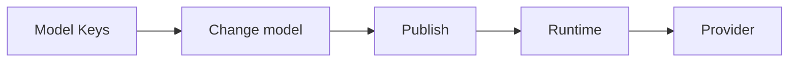

## What Model Keys do

**Model Keys** (Bring Your Own Key, or BYOK) store the credentials Phinite uses to call upstream model providers—Azure OpenAI, Google Vertex, Anthropic on Vertex, and others in your workspace catalog.

You manage keys at the workspace level under **Model Keys** in the sidebar. Each **agent node** can then use either the built-in **Phinite Key** or one of your saved keys when you configure the model in Graph Studio.

## Model Keys vs workspace API keys

Phinite uses two different key concepts in a workspace:

| | Model Keys (BYOK) | Workspace API keys |
| --- | --- | --- |
| Purpose | Authenticate to **model providers** for inference | Authenticate **callers** to Phinite (triggers, external apps) |
| Where | Sidebar → Model Keys | Workspace API Keys |
| Scope | Per workspace | Per workspace |

Model Keys control which provider account pays for LLM usage on an agent step. Workspace API keys control who may invoke your flows and assistants.

## Phinite Key vs custom keys

Every workspace includes a **Phinite Key** card on the Model Keys page. It is marked **Built-in** and uses platform-managed credentials (`phinite-provider`). You do not enter a secret for this option.

Custom keys are named entries for a specific provider. Values are encrypted at rest and shown masked on the list. Users with the right permissions can view, edit, or copy a key from the card actions.

Set a workspace default with **Default Model** in the page header, or per agent node in the **Change model** modal.

## Workflow

| Step | Location | Result |
| ---- | -------- | ------ |
| 1 | [Managing Model Keys](/byok/managing-model-keys) | Store provider credentials; set optional workspace default |
| 2 | [BYOK in Graph Studio](/byok/graph-studio-byok) | Choose resource, operation, model, and key per agent node |
| 3 | [Publishing](/graph-studio/publishing) | Build stores a `byokid` reference, not plaintext secrets |
| 4 | Runtime | Server decrypts the key and calls AI Core |
| 5 | [Billing with BYOK](/byok/billing-and-usage) | Usage with your key is marked `ownKey` for platform billing |

## Plans and access

BYOK is available on **Professional**, **Growth**, and **Enterprise** plans (`features.byok` in the subscription catalog). Free and Builder plans do not include the feature flag.

Access to Model Keys requires appropriate workspace permissions. The UI checks `workspace.api_keys`; the API enforces `workspace.byok`. Administrators should align role assignments with who may create and view provider secrets.

<Info>
Hover the info icon on the Model Keys page for the in-product description of BYOK and how the Phinite Key relates to custom provider keys.
</Info>

## Next steps

<CardGroup cols={2}>
<Card title="Managing Model Keys" href="/byok/managing-model-keys" icon="key">
Add, edit, and set default keys on the workspace page.
</Card>
<Card title="BYOK in Graph Studio" href="/byok/graph-studio-byok" icon="diagram-project">
Configure models and keys on agent nodes.
</Card>
<Card title="Billing with BYOK" href="/byok/billing-and-usage" icon="chart-line">
Platform billing when you use your own provider account.
</Card>
<Card title="Glossary" href="/byok/glossary" icon="book-open">
UI labels, API fields, and permissions.
</Card>
</CardGroup>
