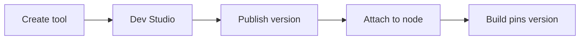

**Tools & Dev Studio** is where you author reusable, versioned functions — custom Python handlers or prebuilt integrations — that **Master Agent**, **Child Agent**, and **Tool** nodes invoke during an [Agent Graph](/agents/overview) run.

<CardGroup cols={2}>
  <Card title="Ways to build" icon="sparkles" href="/devstudio/methods">
    Copilot-generated scaffolds or manual Python coding.
  </Card>
  <Card title="Tool types" icon="wrench" href="/devstudio/types">
    Custom tools, system tools, and prebuilt integrations.
  </Card>
  <Card title="Link to Graph Studio" icon="link" href="/devstudio/linking-tools">
    Attach published tools to agent nodes on the canvas.
  </Card>
  <Card title="Test & publish" icon="flask" type="note" href="/devstudio/testing-tools">
    Run sample inputs in DEV/UAT/PROD before pinning versions on Build.
  </Card>
</CardGroup>

<Note>
  This page is the canonical hub for tools. The legacy path `/tools/overview` redirects here.
</Note>

## Where tools live

| Place | Use |
| --- | --- |
| Workspace **Tools** | Create tools, open **Dev Studio**, manage versions |
| **Open Dev Studio** | Code editor, test panel, publish workflow |
| Graph Studio → **Tools** (sidebar) | Tools scoped to the open Agent Graph |
| Graph Studio → node **Tools** tab | Enable tools on a specific agent node |
| **Build** dialog | Pin published tool versions into an Agent Build |

<Frame caption="Workspace Tools — list, version, and Open Dev Studio">
  
</Frame>

## Golden path

1. Create a tool from workspace **Tools** → **New Tool** (or configure a [prebuilt integration](/devstudio/prebuilt-tools)).
2. Implement in **Dev Studio** ([Copilot](/devstudio/copilot-tools) or [manual Python](/devstudio/manual-coding)).
3. Define [parameters and return shape](/devstudio/structure); store secrets in [env variables](/configure/env-variables), not in code.
4. [Test](/devstudio/testing-tools) in **DEV**, then **Publish** a version ([versioning](/devstudio/versioning)).
5. In [Graph Studio](/graph-studio/overview), attach the published tool to an agent node ([linking tools](/devstudio/linking-tools)).
6. **Save** the graph, then **Build** to pin tool versions for deploy.

<Note>
  **Agent Card** identity (A2A exposure) is separate from workspace **Tools**. Cards describe how external agents discover your graph; Dev Studio tools are callable actions inside a run.
</Note>

## Tool categories

| Category | Description | Doc |
| --- | --- | --- |
| **Custom tools** | Python handlers you author | [Custom tools](/devstudio/custom-tools) |
| **System tools** | Built-in orchestration helpers | [System tools](/devstudio/system-tool) |
| **Predefined tools** | SaaS connectors — connect once, enable subtools per graph | [Predefined tools](/devstudio/prebuilt-tools) · [Integrations Hub](/integrations-hub/overview) |

Connect third-party APIs once under [Integrations](/configure/integrations) or the [Integrations Hub](/integrations-hub/overview), then enable subtools per Agent Graph in Studio.

## Best practices

- Validate inputs and return structured `output` plus `captured_variables` for downstream nodes.
- Log key execution points for [observability](/observability/logs).
- Keep secrets in environment variables; never commit credentials in tool code.
- Increment version numbers with clear release notes before production builds.

<Tip>
  Publish tools in DEV, attach them to a test graph, create a build, and validate in **Test** before promoting to PROD.
</Tip>

## Related

- [Graph Studio agent node tools](/graph-studio/agent-node/tools)
- [Configure integrations](/configure/integrations)
- [Build export](/configure/build-export)
- [Builds overview](/builds/overview)
