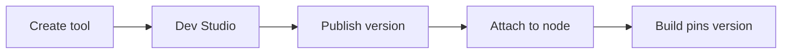

**Tools & Dev Studio** is where you author reusable, versioned functions that **Master Agent**, **Child Agent**, and **Tool** nodes invoke during an [Agent Graph](/agents/overview) run. Custom tools are Python handlers in Dev Studio; **predefined integrations** (Gmail, Jira, Salesforce, …) are configured under [Integrations](/configure/integrations) — see the [Integrations Hub](/integrations-hub/overview) for the full vendor catalog.

<Note>
  This page is the canonical guide for workspace tools. Legacy paths such as `/tools/overview` and `/devstudio/methods` redirect here.
</Note>

## Where tools live

| Place | Use |
| --- | --- |
| Workspace **Tools** | Create tools, open **Dev Studio**, manage versions |
| **Open Dev Studio** | Code editor, Copilot, test panel, publish workflow |
| Graph Studio → **Tools** (sidebar) | Tools scoped to the open Agent Graph |
| Graph Studio → node **Tools** tab | Enable tools on a specific agent node |
| **Build** dialog | Pin published tool versions into an Agent Build |

<Frame caption="Workspace Tools — list, version, and Open Dev Studio">
  
</Frame>

## End-to-end workflow

1. Create a tool from workspace **Tools** → **New Tool** (or connect a [predefined integration](#predefined-tools-not-authored-here) under **Integrations**).
2. Implement in **Dev Studio** — [Copilot](#build-with-copilot) or [manual Python](#build-with-manual-python).
3. Define parameters and return shape; store secrets in [Env. variables](/configure/env-variables), not in code.
4. [Test](#test-and-publish) in **DEV**, then **Publish** a version.
5. In [Graph Studio](/graph-studio/overview), attach the published tool on an agent node ([link to Graph Studio](#link-tools-to-agent-nodes)).
6. **Save** the graph, then **Build** to pin tool versions for deploy.



## Tool types

| Type | Authored in | Versioned | Typical use |
| --- | --- | --- | --- |
| **Custom** | Dev Studio (Python) | Yes | Business APIs, transforms, approvals |
| **System** | Platform (built-in) | No | Flow control, RAG retrieval, status updates |
| **Predefined** | Integrations hub | Per connection | SaaS connectors — OAuth or API tokens |

### System tools

System tools ship with the platform and appear on every agent node without publishing:

| Tool | Purpose |
| --- | --- |
| **RAG Tool** | Retrieve from [RAG Data](/graph-studio/rag-management) attached to the node |
| **Finish Tool** | Complete the current agent step |
| **End Agent Graph Tool** | Terminate the entire graph immediately |
| **Agent Graph Insight Tool** | Status updates while long operations run |

Mention each tool explicitly in the agent **prompt** when it should be called. Use **Finish** to complete a step; use **End Agent Graph** only when the whole run must stop.

## Build with Copilot

Dev Studio **Copilot** drafts Python handlers from a natural-language spec. Review and harden the scaffold before publish.

<Frame caption="Dev Studio Copilot — describe the tool and review generated code">
  
</Frame>

1. Open **Dev Studio** from workspace **Tools** (new or existing tool).
2. Open the **Copilot** panel and describe purpose, expected **inputs** and **outputs**, and target system.
3. Review generated handler, parameter schema, and error handling.
4. Edit validation, `env_variables` access, and return shape to match the [tool contract](#tool-contract) below.
5. [Test](#test-and-publish) with realistic sample JSON, then **Publish**.

<Tip>
  Copilot scaffolds are a starting point — not production-ready without review. Write a clear tool **description**; agents use it to decide when to call the tool.
</Tip>

## Build with manual Python

Use manual coding when Copilot or a predefined integration is not enough.

### Tool contract

Every custom tool uses one entrypoint:

```python
def main(inputs, env_variables):
    return {
        "output": { ... },
        "captured_variables": { ... }
    }
```

| Argument | Source | Purpose |
| --- | --- | --- |
| `inputs` | Session variables (user, capture, API payload) | Runtime parameters from the Agent Graph |
| `env_variables` | [Env. variables](/configure/env-variables) (DEV / UAT / PROD) | Secrets, API keys, endpoints |

| Return key | Purpose |
| --- | --- |
| `output` | Primary result for the calling agent — prefer structured JSON |
| `captured_variables` | Values stored on the session for downstream nodes and tools |

<Warning>
  Never hardcode API keys. Use `env_variables.get("API_KEY")`. Some legacy examples use `capture_variables`; new tools should use `captured_variables`.
</Warning>

### Example handler

```python
def main(inputs, env_variables):
    try:
        product_id = inputs.get("product_id")
        api_key = env_variables.get("INVENTORY_API_KEY")
        # ... call external API ...
        return {
            "output": {"stock": 42, "product_name": "Example"},
            "captured_variables": {"current_stock": 42}
        }
    except Exception as e:
        return {"output": {"error": str(e)}, "captured_variables": {}}
```

Define parameter types and descriptions in Dev Studio so the runtime validates inputs and agents choose arguments correctly.

## Test and publish

### Run a test

1. Open the tool in **Dev Studio** → **Test** tab.
2. Enter realistic sample input JSON (fields the tool expects in `inputs`).
3. Choose **Dev**, **UAT**, or **Prod** so `env_variables` resolve from the matching environment.
4. Review stdout, errors, and returned `output` / `captured_variables`.
5. Fix handler logic, re-test, then **Publish** when results match expectations.

<Frame caption="Dev Studio Test panel — sample inputs and environment selector">
  
</Frame>

<Warning>
  Never include real secrets in sample inputs. Use placeholders; secrets belong in environment variables.
</Warning>

### Publish and version

1. **Draft** — edit handler and parameters in Dev Studio.
2. **Test** — validate in Dev (and UAT per your process).
3. **Publish** — create an immutable version with release notes.
4. **Build** — pin published versions when you build the Agent Graph.

Unpublished tools show **Publish** in the **Build** dialog. Keep prior versions for rollback: re-attach a known-good version in Graph Studio, **Save**, create a new **Build**, and redeploy.

## Link tools to agent nodes

Published tools attach to **Master Agent**, **Child Agent**, and **Tool** nodes in Graph Studio.

1. Open the Agent Graph in [Graph Studio](/graph-studio/overview).
2. Select a node → drawer **Tools** tab.
3. Click **Add tool** and pick a **published** tool.
4. For predefined integrations, select a **connection** or add one under [Integrations](/configure/integrations).
5. Map **input variables** from the session to tool parameters where shown.
6. **Save** the graph before **Build**.

<Frame caption="Tools tab — add and enable published tools">
  
</Frame>

See also [Agent node tools tab](/graph-studio/agent-node/tools) and [Tool node](/graph-studio/nodes/tool-node).

## Predefined tools (not authored here)

**Predefined tools** are platform-packaged integrations — not Python in Dev Studio. Connect once under workspace **Integrations**, then enable **subtools** on agent nodes in Graph Studio.

1. **Integrations** → **Predefined tools** → **Add Configuration** → save credentials.
2. Graph Studio → agent **Tools** tab → pick the integration → enable subtools → **Save** → **Build**.

<CardGroup cols={2}>
  <Card title="Integrations Hub" icon="plug" href="/integrations-hub/overview">
    Full vendor catalog — credentials, subtools, and setup per integration.
  </Card>
  <Card title="Gmail example" icon="envelope" href="/integrations-hub/gmail">
    Inbox automation — one of many predefined tools.
  </Card>
  <Card title="Configure integrations" icon="sliders" href="/configure/integrations">
    Workspace hub for channels, tools, and triggers.
  </Card>
  <Card title="Jira example" icon="ticket" href="/integrations-hub/jira">
    Issue automation — connect → enable subtools → Build.
  </Card>
</CardGroup>

<Tip>
  Grant least privilege — enable only the subtools each graph needs.
</Tip>

## Best practices

- Validate inputs and return structured `output` plus `captured_variables` for downstream nodes.
- Log key execution points for [observability](/observability/logs).
- Publish in DEV, attach to a test graph, **Build**, and validate in **Test** before PROD.
- **Agent Card** identity (A2A) is separate from workspace **Tools** — cards describe external discovery; Dev Studio tools are callable actions inside a run.

## Related

- [Graph Studio agent node tools](/graph-studio/agent-node/tools)
- [Build export](/configure/build-export)
- [Builds overview](/builds/overview)
- [Common build failures](/support/build-failures)
