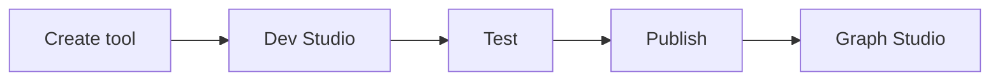

**Tools & Dev Studio** is the workspace editor for reusable, versioned functions that **Master Agent**, **Child Agent**, and **Tool** nodes call during an [Agent Graph](/agents/overview) run.

<CardGroup cols={2}>
  <Card title="Methods" icon="sparkles" href="/devstudio/methods">
    Copilot scaffolds or manual Python.
  </Card>
  <Card title="Custom tools" icon="screwdriver-wrench" href="/devstudio/custom-tools">
    Structure, test, publish, attach in Graph Studio.
  </Card>
  <Card title="Predefined tools" icon="plug" href="/devstudio/prebuilt-tools">
    Integrations Hub — not authored in Dev Studio.
  </Card>
  <Card title="Env. variables" icon="key" href="/configure/env-variables">
    Secrets for tools at DEV / UAT / PROD.
  </Card>
</CardGroup>

## Create, attach, and pin tools

Use these workspace and Graph Studio surfaces at each stage of the tool lifecycle:

| UI location | What you do |
| --- | --- |
| Workspace sidebar → **Tools** | Create a tool, click **Open Dev Studio**, publish versions |
| Graph Studio → **Tools** (left sidebar) | View tools linked to the open Agent Graph |
| Graph Studio → select a node → drawer **Tools** tab | Enable a published or predefined tool on that step |
| Graph Studio toolbar → **Build** | Pin published tool versions into an Agent Build |

<Note>
  **Tools** in the workspace sidebar is where you author and version tools. The node drawer **Tools** tab is where you attach them to a graph step.
</Note>

<Frame caption="Workspace Tools — list and Open Dev Studio">
  
</Frame>

## Golden path

1. Create a tool → implement in Dev Studio ([Methods](/devstudio/methods)).
2. Define structure and test ([Custom tools](/devstudio/custom-tools)).
3. **Publish** a version.
4. Attach in [Graph Studio](/graph-studio/agent-node) → **Save** → **Build**.

## Tool types

| Type | Where | Versioned |
| --- | --- | --- |
| **Custom** | Dev Studio Python | Yes |
| **System** | Platform built-ins | No |
| **Predefined** | [Integrations Hub](/integrations-hub/overview) | Per connection |

### System tools

| Tool | Purpose |
| --- | --- |
| **RAG Tool** | Retrieve from RAG attached to the node |
| **Finish Tool** | Complete the current agent step |
| **End Agent Graph Tool** | Terminate the entire graph |
| **Agent Graph Insight Tool** | Status updates during long operations |

Mention each in the agent **prompt** when it should be called.

## Test tools

Run tools in the Dev Studio **Test** tab before publish:

1. Enter sample input JSON for `inputs`.
2. Select **Dev**, **UAT**, or **Prod** so `env_variables` resolve correctly.
3. Review `output` and `captured_variables`.

Full procedure: [Custom tools — Test](/devstudio/custom-tools#test-tools).

## Publish versions

Only **published** versions appear in Graph Studio and pin on **Build**. Draft → test → **Publish** with release notes → attach in Graph Studio.

Unpublished tools show **Publish** in the **Build** dialog. Roll back by re-attaching a prior version.

Full procedure: [Custom tools — Publish](/devstudio/custom-tools#publish-versions).

## Logs and debugging

After linking a tool to a graph:

- [Session logs](/observability/logs) — runtime execution
- [Variable capture logs](/observability/logs/variables) — `captured_variables` from tools
- [Common build failures](/support/build-failures) — unpublished or misconfigured tools

## Related

- [Graph Studio — Tools tab](/graph-studio/agent-node)
- [Builds overview](/builds/overview)
- [Configure integrations](/configure/integrations)
