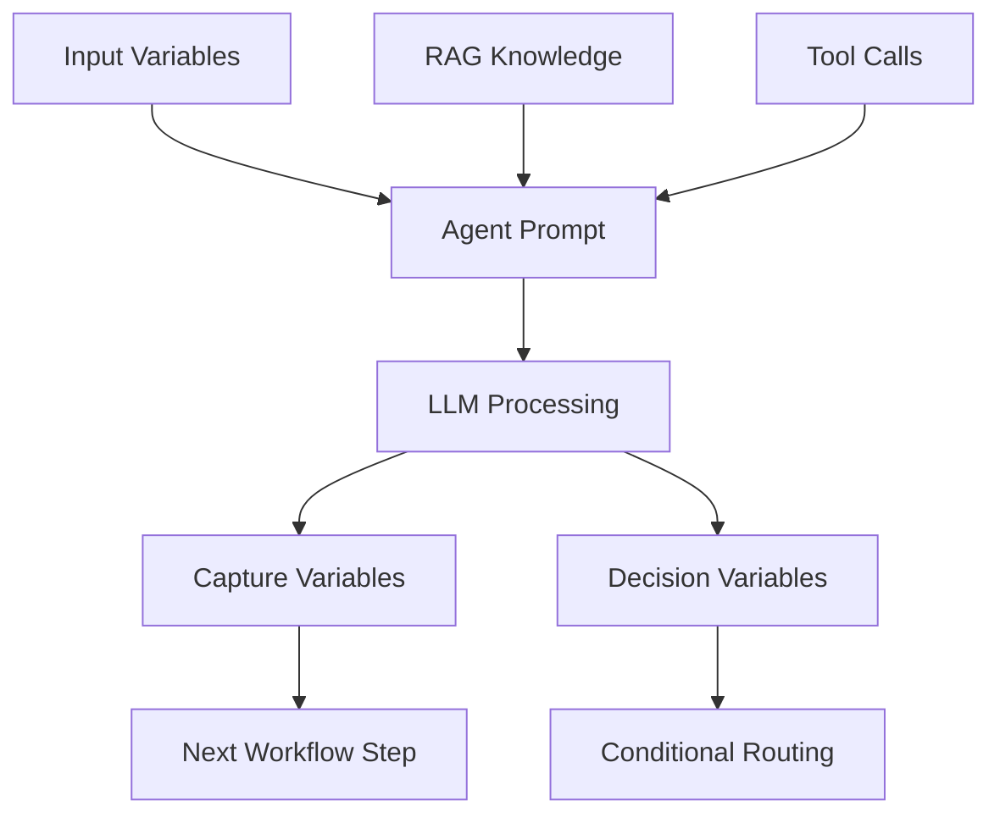

## Agent components overview

Every agent block in Flowgen Studio consists of four essential components that work together to create intelligent, context-aware automation. Understanding how these components interact is crucial for building effective workflows.

<CardGroup cols={2}>
<Card title="Agent Prompt" href="/flowgen/agent-block/prompt" icon="file-text">
Define the agent's personality, behavior, and decision-making logic with structured prompts.
</Card>
<Card title="RAG (Knowledge Base)" href="/flowgen/agent-block/rag" icon="book">
Ground responses with enterprise data from connected sources and collections.
</Card>
<Card title="Tools Integration" href="/flowgen/agent-block/tools" icon="wrench">
Enable external actions through API calls, database queries, and third-party integrations.
</Card>
<Card title="Variables (Input & Capture)" href="/flowgen/agent-block/variables" icon="database">
Manage data flow with input variables and capture outputs for downstream processing.
</Card>
</CardGroup>

## Component interaction flow



## Access control considerations

<Warning>
Agent configuration requires "Developer" role or higher. Users with "Tester" or "Viewer" roles can only view agent settings but cannot modify them.
</Warning>

### Role-based restrictions
- **SuperAdmin/Admin**: Full access to all agent components and debugging tools
- **Developer**: Can configure prompts, RAG, tools, and variables; cannot publish to production
- **Tester**: Read-only access for testing purposes; can view execution logs
- **Viewer**: Limited to viewing published agent configurations only

## Debugging agent issues

### Common problems and solutions

<AccordionGroup>
<Accordion title="Agent not responding as expected">
**Symptoms**: Agent gives irrelevant or incorrect responses

**Debugging steps**:
1. Check prompt clarity and specificity in the [Agent Prompt](/flowgen/agent-block/prompt) tab
2. Verify RAG sources are properly attached and contain relevant information
3. Review execution logs in the [Observability](/observability/logs) section
4. Test with sample inputs to isolate the issue

**Sample debugging code**:
```javascript
// Check agent response quality
const testPrompt = "Analyze this customer query: 'I need help with my order'";
const expectedResponse = "The agent should identify this as a customer service request";
```

**Resolution**: Refine the prompt with more specific instructions and examples
</Accordion>

<Accordion title="RAG knowledge not being used">
**Symptoms**: Agent ignores attached knowledge sources

**Debugging steps**:
1. Verify data sources are properly connected in [RAG Management](/flowgen/rag-management)
2. Check if collections contain relevant information for the query
3. Review agent's RAG configuration in the Inspector panel
4. Test with queries that should trigger knowledge retrieval

**Sample debugging code**:
```javascript
// Test RAG retrieval
const testQuery = "What is our company's refund policy?";
// Should retrieve policy document from RAG sources
```

**Resolution**: Ensure RAG sources are relevant and properly indexed
</Accordion>

<Accordion title="Tool integration failures">
**Symptoms**: External API calls failing or returning errors

**Debugging steps**:
1. Check tool authentication and API keys in [DevStudio](/devstudio/overview)
2. Verify tool parameters and input mapping
3. Review error logs in the execution timeline
4. Test tools independently outside the workflow

**Sample debugging code**:
```javascript
// Test tool integration
const toolTest = {
  toolId: "email-sender",
  parameters: {
    to: "test@example.com",
    subject: "Test email",
    body: "This is a test"
  }
};
```

**Resolution**: Fix authentication, parameter mapping, or API endpoint issues
</Accordion>

<Accordion title="Variable capture issues">
**Symptoms**: Expected data not being captured or passed to next steps

**Debugging steps**:
1. Verify variable names match between capture and usage points
2. Check data types and formats are consistent
3. Review variable scope and availability
4. Test with known input values

**Sample debugging code**:
```javascript
// Test variable capture
const inputData = {
  customerEmail: "user@example.com",
  orderId: "12345"
};
// Verify these are captured and available downstream
```

**Resolution**: Fix variable naming, data types, or scope issues
</Accordion>
</AccordionGroup>

## Best practices

### Prompt engineering
- **Be specific**: Clearly define the agent's role, context, and expected outputs
- **Provide examples**: Include sample inputs and desired responses
- **Set boundaries**: Define what the agent should and shouldn't do
- **Test iteratively**: Refine prompts based on actual performance

### RAG optimization
- **Curate sources**: Only attach relevant, high-quality knowledge sources
- **Organize collections**: Group related documents for better retrieval
- **Monitor usage**: Track which sources are actually being used
- **Update regularly**: Keep knowledge sources current and accurate

### Tool management
- **Error handling**: Implement robust error handling for external calls
- **Rate limiting**: Respect API rate limits and implement backoff strategies
- **Security**: Use secure authentication methods and protect sensitive data
- **Monitoring**: Track tool performance and success rates

### Variable design
- **Consistent naming**: Use clear, descriptive variable names
- **Type safety**: Ensure data types are consistent across the workflow
- **Documentation**: Document variable purposes and expected formats
- **Validation**: Implement validation for critical variables

## Integration with other Phinite components

### Assistant integration
- **[Conversational Assistants](/assistants/conversational)**: Agents power chat and voice interactions
- **[Email Assistants](/assistants/email)**: Agents process and respond to email communications
- **[Autonomous Assistants](/assistants/autonomous)**: Agents execute background automation tasks

### Tool ecosystem
- **[Custom Tools](/devstudio/custom-tools)**: Build specialized tools for specific use cases
- **[Pre-built Integrations](/devstudio/prebuilt-tools)**: Leverage existing integrations with popular services
- **[Tool Versioning](/devstudio/versioning)**: Manage tool updates and compatibility

### Observability and monitoring
- **[Execution Logs](/observability/logs)**: Monitor agent performance and debug issues
- **[Usage Metrics](/observability/usage-metrics)**: Track token usage and performance metrics
- **[Error Tracking](/support/error-codes)**: Identify and resolve common issues

## Next steps

1. **[Configure your first agent](/flowgen/agent-block/prompt)**: Start with prompt design
2. **[Add knowledge sources](/flowgen/agent-block/rag)**: Connect relevant data
3. **[Integrate tools](/flowgen/agent-block/tools)**: Enable external capabilities
4. **[Set up variables](/flowgen/agent-block/variables)**: Manage data flow
5. **[Test and debug](/observability/logs)**: Monitor performance and resolve issues
