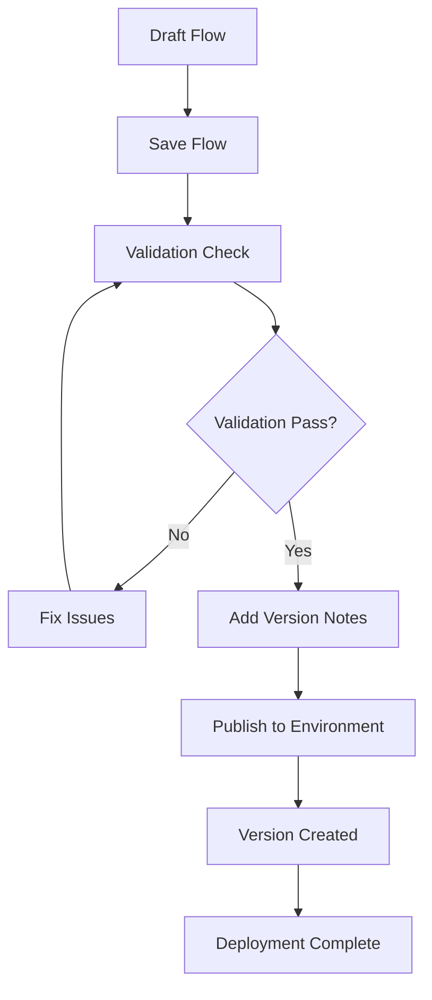

## Publishing overview

Flow publishing in Phinite provides enterprise-grade deployment capabilities with full version control, access management, and observability. Understanding the publishing process is crucial for maintaining stable, secure, and auditable workflows.

### Publishing workflow



## Access control and permissions

<Warning>
Publishing flows requires "Admin" or "SuperAdmin" role. Users with "Developer" role can save flows but cannot publish them to production environments.
</Warning>

### Role-based publishing permissions

| Role | Can Save Flows | Can Publish to Dev | Can Publish to UAT | Can Publish to Prod |
|------|----------------|-------------------|-------------------|-------------------|
| **SuperAdmin** | ✅ | ✅ | ✅ | ✅ |
| **Admin** | ✅ | ✅ | ✅ | ✅ |
| **Developer** | ✅ | ✅ | ❌ | ❌ |
| **Tester** | ❌ | ❌ | ❌ | ❌ |
| **Viewer** | ❌ | ❌ | ❌ | ❌ |

### Environment-specific access

- **Development**: All users with "Developer" role or higher
- **UAT**: Requires "Admin" role for publishing
- **Production**: Requires "Admin" or "SuperAdmin" role with additional approval workflows

## Pre-publishing checklist

### Flow validation requirements

<Check>
- [ ] Flow is saved successfully
- [ ] All required block fields are filled
- [ ] Agent prompts are complete and tested
- [ ] RAG sources are properly connected
- [ ] Tool integrations are configured
- [ ] Variables are properly mapped
- [ ] Conditional edges have valid logic
- [ ] Flow has clear Start and End blocks
- [ ] No orphaned blocks or disconnected components
</Check>

### Common validation failures

<AccordionGroup>
<Accordion title="Missing required fields">
**Error**: "Please fill all required details for the following blocks: agent, tool"

**Debugging steps**:
1. Check each block in the Inspector panel
2. Verify all required fields are populated
3. Look for red validation indicators
4. Test blocks individually before publishing

**Sample validation code**:
```javascript
// Check block validation
const validateBlock = (block) => {
  const requiredFields = {
    'task': ['name', 'task_prompt'],
    'api': ['toolid', 'name'],
    'flow': ['flowid', 'name']
  };
  
  const blockType = block.type;
  const missingFields = requiredFields[blockType]?.filter(
    field => !block.data?.details?.[field]
  );
  
  return missingFields || [];
};
```

**Resolution**: Fill all required fields and re-validate
</Accordion>

<Accordion title="Invalid connections">
**Error**: "Flow contains invalid connections or orphaned blocks"

**Debugging steps**:
1. Check for blocks without proper connections
2. Verify Start block has outgoing connections
3. Ensure End blocks have incoming connections
4. Look for disconnected blocks in the canvas

**Sample debugging code**:
```javascript
// Check flow connectivity
const validateConnections = (nodes, edges) => {
  const startNodes = nodes.filter(n => n.type === 'start');
  const endNodes = nodes.filter(n => n.type === 'end');
  const orphanedNodes = nodes.filter(n => 
    n.type !== 'start' && n.type !== 'end' && 
    !edges.some(e => e.target === n.id || e.source === n.id)
  );
  
  return {
    hasStart: startNodes.length > 0,
    hasEnd: endNodes.length > 0,
    orphanedCount: orphanedNodes.length
  };
};
```

**Resolution**: Connect all blocks properly and ensure flow integrity
</Accordion>

<Accordion title="Tool integration errors">
**Error**: "Tool integration failed validation"

**Debugging steps**:
1. Check tool authentication in [DevStudio](/devstudio/overview)
2. Verify API keys and credentials
3. Test tools independently
4. Review tool parameter mapping

**Sample debugging code**:
```javascript
// Test tool integration
const testTool = async (toolId, parameters) => {
  try {
    const response = await fetch(`/api/tools/${toolId}/test`, {
      method: 'POST',
      headers: { 'Content-Type': 'application/json' },
      body: JSON.stringify(parameters)
    });
    
    if (!response.ok) {
      throw new Error(`Tool test failed: ${response.statusText}`);
    }
    
    return await response.json();
  } catch (error) {
    console.error('Tool validation error:', error);
    throw error;
  }
};
```

**Resolution**: Fix tool configuration and authentication
</Accordion>
</AccordionGroup>

## Publishing process

### Step-by-step publishing

<Steps>
<Step title="Save your flow">
  Click "Save" in the studio header to persist your changes.
  
  <Check>
  You should see a success message confirming the flow is saved.
  </Check>
</Step>

<Step title="Run validation">
  The system automatically validates your flow before publishing.
  
  <Warning>
  If validation fails, you'll see specific error messages indicating what needs to be fixed.
  </Warning>
</Step>

<Step title="Add version details">
  Provide a clear description of changes in this version.
  
  **Good version notes**:
  ```markdown
  Version 2.1.0 - Customer Service Flow
  - Added RAG integration for policy knowledge
  - Improved error handling for payment failures
  - Updated email templates for better customer experience
  - Fixed issue with order lookup timeout
  ```
  
  **Poor version notes**:
  ```markdown
  Updated stuff
  ```
</Step>

<Step title="Select target environment">
  Choose the appropriate environment for deployment.
  
  <Note>
  Production deployments may require additional approval workflows depending on your organization's policies.
  </Note>
</Step>

<Step title="Confirm and publish">
  Review all settings and confirm the publication.
  
  <Check>
  You should see a success message and the new version in the version history.
  </Check>
</Steps>

## Version management

### Version history interface

The version history panel (`Sidebar/canvas/VersionHistory.tsx`) provides comprehensive version management:

- **Version list**: View all published versions with timestamps and notes
- **Version details**: Inspect specific version configurations
- **Copy to draft**: Create a new draft based on any published version
- **Environment status**: See which environments each version is deployed to

### Version numbering

Phinite automatically manages version numbers:
- **First version**: Starts at version 1
- **Subsequent versions**: Incrementally numbered (2, 3, 4, etc.)
- **Draft versions**: Not numbered until published
- **Version notes**: Required for all published versions

### Copying versions to draft

<Steps>
<Step title="Access version history">
  Click "Version History" in the studio sidebar.
</Step>

<Step title="Select source version">
  Choose the version you want to copy from the list.
</Step>

<Step title="Copy to draft">
  Click "Copy to Draft" and confirm the action.
</Step>

<Step title="Edit and republish">
  Make your changes and publish as a new version.
</Step>
</Steps>

## Debugging publishing issues

### Common publishing problems

<AccordionGroup>
<Accordion title="Publishing fails with validation errors">
**Symptoms**: Flow fails to publish with validation error messages

**Debugging steps**:
1. Review the specific validation error messages
2. Check each block for missing required fields
3. Verify all connections are valid
4. Test individual components before publishing

**Sample debugging code**:
```javascript
// Comprehensive flow validation
const validateFlowForPublishing = (flow) => {
  const errors = [];
  
  // Check for required blocks
  if (!flow.nodes.some(n => n.type === 'start')) {
    errors.push('Flow must have a Start block');
  }
  
  if (!flow.nodes.some(n => n.type === 'end')) {
    errors.push('Flow must have an End block');
  }
  
  // Check block configurations
  flow.nodes.forEach(node => {
    if (node.type === 'task' && !node.data?.details?.task_prompt) {
      errors.push(`Agent block ${node.id} missing prompt`);
    }
    
    if (node.type === 'api' && !node.data?.details?.toolid) {
      errors.push(`Tool block ${node.id} missing tool configuration`);
    }
  });
  
  return errors;
};
```

**Resolution**: Address all validation errors before attempting to publish
</Accordion>

<Accordion title="Version creation fails">
**Symptoms**: Flow saves but version creation fails

**Debugging steps**:
1. Check network connectivity
2. Verify user permissions
3. Review server logs for errors
4. Try publishing to a different environment

**Sample debugging code**:
```javascript
// Test publishing API
const testPublishing = async (flowId, versionDetails) => {
  try {
    const response = await fetch(`/api/flows/${flowId}/publish`, {
      method: 'POST',
      headers: {
        'Content-Type': 'application/json',
        'Authorization': `Bearer ${authToken}`
      },
      body: JSON.stringify({
        versionDetails,
        environment: 'dev'
      })
    });
    
    if (!response.ok) {
      const error = await response.json();
      throw new Error(`Publishing failed: ${error.message}`);
    }
    
    return await response.json();
  } catch (error) {
    console.error('Publishing error:', error);
    throw error;
  }
};
```

**Resolution**: Check permissions, network, and server status
</Accordion>

<Accordion title="Environment deployment issues">
**Symptoms**: Version created but deployment to target environment fails

**Debugging steps**:
1. Check environment configuration
2. Verify environment-specific settings
3. Review deployment logs
4. Test with a simpler flow first

**Sample debugging code**:
```javascript
// Check environment status
const checkEnvironmentStatus = async (environment) => {
  try {
    const response = await fetch(`/api/environments/${environment}/status`);
    const status = await response.json();
    
    return {
      isHealthy: status.health === 'healthy',
      lastDeployment: status.lastDeployment,
      activeVersions: status.activeVersions
    };
  } catch (error) {
    console.error('Environment check failed:', error);
    return { isHealthy: false, error: error.message };
  }
};
```

**Resolution**: Fix environment configuration or contact system administrator
</Accordion>
</AccordionGroup>

## Post-publishing monitoring

### Deployment verification

<Steps>
<Step title="Check deployment status">
  Verify the flow is successfully deployed to the target environment.
</Step>

<Step title="Test flow execution">
  Run test scenarios to ensure the flow works as expected.
</Step>

<Step title="Monitor performance">
  Use [Observability](/observability/overview) tools to track flow performance.
</Step>

<Step title="Review logs">
  Check [execution logs](/observability/logs) for any issues or errors.
</Step>
</Steps>

### Performance monitoring

- **Execution success rate**: Track how often flows complete successfully
- **Response times**: Monitor flow execution duration
- **Error rates**: Identify common failure points
- **Resource usage**: Track token consumption and API calls

## Best practices

### Version management
- **Descriptive notes**: Always provide clear, actionable version descriptions
- **Incremental changes**: Make small, focused changes rather than large overhauls
- **Testing**: Thoroughly test flows before publishing to production
- **Rollback plan**: Keep previous versions available for quick rollback

### Security considerations
- **Access control**: Regularly review who has publishing permissions
- **Environment isolation**: Maintain strict separation between environments
- **Audit trails**: Monitor all publishing activities for compliance
- **Secret management**: Ensure sensitive data is properly secured

### Performance optimization
- **Efficient flows**: Design flows for optimal performance and resource usage
- **Monitoring**: Set up alerts for performance degradation
- **Scaling**: Plan for increased load and usage patterns
- **Optimization**: Continuously optimize based on performance data

## Integration with other components

### Assistant integration
- **[Conversational Assistants](/assistants/conversational)**: Deploy flows for chat and voice interactions
- **[Email Assistants](/assistants/email)**: Publish flows for email automation
- **[Autonomous Assistants](/assistants/autonomous)**: Deploy background automation flows

### Observability integration
- **[Execution Logs](/observability/logs)**: Monitor published flow performance
- **[Usage Metrics](/observability/usage-metrics)**: Track flow usage and performance
- **[Error Tracking](/support/error-codes)**: Identify and resolve issues

### Environment management
- **[Build Configuration](/builds/configuration)**: Configure deployment settings
- **[Environment Variables](/builds/env-variables)**: Manage environment-specific configuration
- **[Testing & Deployment](/builds/testing-deployment)**: Implement proper testing workflows
