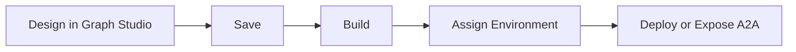

Phinite is where you design **Agent Graphs**, freeze them into **Builds**, assign them to **Environments**, then **Deploy** to a channel or trigger — or **Expose as A2A** via an Agent Card.

<CardGroup cols={2}>
  <Card title="Quickstart" icon="rocket" href="/getting-started/quickstart">
    Empty workspace to a deployable build in one pass.
  </Card>
  <Card title="What you can build" icon="lightbulb" href="/getting-started/what-you-can-build">
    Conversational and Autonomous use cases by industry.
  </Card>
  <Card title="Agent Graphs" icon="diagram-project" href="/agents/overview">
    Choose Conversational or Autonomous when you create a graph.
  </Card>
  <Card title="Glossary" icon="book" type="note" href="/reference/glossary-v2">
    Current product terms — Agent Graph, Build, Channel, Trigger, Agent Card.
  </Card>
</CardGroup>

## Agent types

| Type | Meaning | Typical deploy targets |
| --- | --- | --- |
| **Conversational** | Real-time voice or chat with users | Channel, Chat API, A2A |
| **Autonomous** | Background runs without a live user | API trigger, Cron, A2A (coming soon) |

## Golden path

1. Create an **Agent Graph** (Conversational or Autonomous).
2. Design it in [Graph Studio](/graph-studio/overview) — nodes, tools, RAG, variables.
3. **Save**, then **Build** (pins graph + tool versions).
4. Assign the build to **DEV** / **UAT** / **PROD**.
5. **Deploy** to a Channel, Chat API, or Trigger — **or** **Expose as A2A** (Agent Card TEST → LIVE).

<Frame caption="Workspace Home — create and open Agent Graphs">
  
</Frame>

## Surfaces you will use

| Surface | Job |
| --- | --- |
| **Workspace Home** | Create and open Agent Graphs |
| **Graph Studio** | Design, Save, Build, Deploy, Test |
| **Tools & Dev Studio** | Create and publish tools |
| **Integrations** | Channels, Integration Tools, Triggers |
| **Env. variables** | DEV / UAT / PROD secrets |
| **Agent Registry** | Browse exposed A2A agents |

## Core concepts

| Concept | Description |
| --- | --- |
| **Agent Graph** | Visual decision graph with nodes that orchestrate logic, tools, and conversations |
| **Node** | Canvas building block — prompts a model, calls a tool, captures input, or routes decisions |
| **Tool** | Callable API, function, or integration used by agent nodes |
| **Build** | Immutable snapshot of graph + pinned tool versions |
| **Environment** | DEV, UAT, or PROD — where a build runs and which env variables apply |
| **Channel** | Messaging ingress (web chat, WhatsApp, Slack, voice, email) wired to a build |
| **Trigger** | Webhook or schedule that starts an Autonomous graph run |
| **Session** | One execution of an agent graph, recorded in logs with inputs, decisions, and metrics |
| **Agent Registry** | Workspace catalog of Agent Cards and hosted A2A endpoints |

## Who uses Phinite

| Role | Responsibilities |
| --- | --- |
| **Developers** | Build tools, wire integrations, and design agent graphs |
| **Architects** | Plan graph logic, manage builds, and configure environments |
| **Admins** | Control access, invite users, and manage billing |
| **Testers** | Validate graph behavior and run debug sessions |
| **Analysts** | Observe sessions, track model usage, and monitor outcomes |

<Tip>
  Phinite is built for teams that want AI systems that reason, decide, and act — not just chatbots. Start with one graph in DEV, then promote builds through UAT to PROD.
</Tip>

## Next steps

- [Quickstart](/getting-started/quickstart)
- [Workspace overview](/workspaces/workspace-overview)
- [Graph Studio overview](/graph-studio/overview)
- [Agent Registry](/agent-registry/overview)
