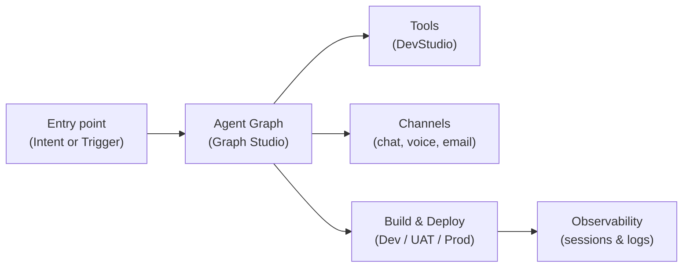

Phinite enables teams to build and deploy intelligent agents securely across channels and workflows. Start here to pick a **solution type**, understand what each agent can do, and jump into the right guide.

---

## Choose your solution type

| Solution type | Best for | How it starts | Where it runs |
| --- | --- | --- | --- |
| **Conversational** | Real-time chat and voice | [Intents](/triggers-intents/intents) — natural language routing | Web Chat, WhatsApp, Slack, Teams, Twilio |
| **Email** | Inbox triage and async replies | [Intents](/triggers-intents/intents-email) — classify inbound mail | Email (Gmail, Outlook, SendGrid, etc.) |
| **Autonomous** | Background jobs and system automation | [Triggers](/triggers-intents/triggers) — API, cron, or events | Webhooks, schedulers, integration funnels |

<CardGroup cols={3}>
  <Card title="Conversational" icon="comments" href="/assistants/conversational">
    Support bots, schedulers, knowledge Q&A across chat and voice channels.
  </Card>
  <Card title="Email" icon="envelope" href="/assistants/email">
    Lead triage, ticket routing, and operational mailroom automation.
  </Card>
  <Card title="Autonomous" icon="robot" href="/assistants/autonomous">
    Reports, data sync, compliance checks, and cross-system orchestration.
  </Card>
</CardGroup>

<Note>
  Every solution type is powered by [Agent Graphs](/graph-studio/overview) in Graph Studio and can call [Tools](/devstudio/overview) from DevStudio. The difference is **how the workflow starts** and **which channel** it uses.
</Note>

---

## Solution patterns by use case

<Tabs>
  <Tab title="Conversational">
    **Purpose:** Engage users through chat or voice with context, retrieval, and orchestration.

    **Examples**
    - Support or HR FAQ assistants
    - Appointment schedulers
    - Knowledge-grounded internal helpdesks

    **Key capabilities**
    - Contextual conversations with shared memory
    - Integration with chat, voice, and retrieval tools
    - RBAC-controlled environments for compliance
    - Agent graph testing and audit logging

    **Common patterns**

    <Accordion title="Customer support & HR">
      Answer FAQs, escalate tickets, and sync outcomes to CRM or Slack.
    </Accordion>
    <Accordion title="Appointment & scheduling">
      Automate booking flows using Google Calendar, HubSpot Meetings, or custom APIs.
    </Accordion>
    <Accordion title="Knowledge Q&A">
      Ground conversations on internal documents or RAG collections for accurate responses.
    </Accordion>

    **Constraints**
    - Requires pre-configured channels and knowledge stores
    - Multi-turn reasoning relies on agent graph logic, not full open-ended autonomy

    → [Conversational assistant guide](/assistants/conversational) · [Intents](/triggers-intents/intents) · [Channels](/integrations-hub/channels/overview)
  </Tab>

  <Tab title="Email">
    **Purpose:** Automate inbound and outbound email flows while maintaining auditability and compliance.

    **Examples**
    - Sales lead triage and auto-replies
    - Support ticket acknowledgment and escalation
    - Invoice, receipt, and operational mail handling

    **Key capabilities**
    - Triggered by inbound or outbound email events
    - Classify, respond, route, and escalate using agent graph logic
    - Secure environment variables and masked SMTP/API credentials
    - Integration-ready for Gmail, Outlook, SendGrid, and more

    **Common patterns**

    <Accordion title="Sales & lead triage">
      Parse and qualify leads from inboxes, auto-assign owners, and send initial replies.
    </Accordion>
    <Accordion title="Support automation">
      Auto-acknowledge support tickets and escalate based on classification.
    </Accordion>
    <Accordion title="Internal mailroom">
      Handle operational mail like invoices, receipts, and confirmations.
    </Accordion>

    **Constraints**
    - Requires authenticated email connectors
    - Not a replacement for a full email client or spam filter

    → [Email assistant guide](/assistants/email) · [Email intents](/triggers-intents/intents-email) · [Email channel](/integrations-hub/channels/email)
  </Tab>

  <Tab title="Autonomous">
    **Purpose:** Execute background and cross-system workflows that connect data, APIs, and logic.

    **Examples**
    - Nightly data syncs and report generation
    - Compliance validation and audit evidence collection
    - Webhook-driven integrations (Jira, CRM, custom apps)

    **Key capabilities**
    - Visual multi-agent orchestration in Graph Studio
    - [Agent Registry (A2A)](/agent-registry/overview) for exposing and composing external agents
    - Manager–Worker and workflow modes
    - Environment-specific variable and credential control
    - End-to-end RBAC, audit logs, and observability

    **Common patterns**

    <Accordion title="Operations & back office">
      Automate repetitive processes like data enrichment, validation, and reporting.
    </Accordion>
    <Accordion title="Compliance & audit">
      Collect evidence, run validations, and maintain compliance logs.
    </Accordion>
    <Accordion title="Data pipelines">
      Ingest, transform, and publish structured data using external APIs and schedulers.
    </Accordion>

    **Constraints**
    - Business-logic orchestration only — not infra-level automation
    - Requires preconfigured API keys and retry-safe agent graph design

    → [Autonomous assistant guide](/assistants/autonomous) · [Triggers](/triggers-intents/triggers) · [Trigger APIs](/triggers-intents/triggers/api-guide)
  </Tab>
</Tabs>

---

## How solutions fit together

Every assistant — regardless of type — shares the same building blocks:

| Building block | What it does | Learn more |
| --- | --- | --- |
| **Entry point** | Starts the workflow — intents for conversational/email, triggers for autonomous | [Triggers & Intents](/triggers-intents/overview) |
| **Agent Graph** | Visual logic: agents, tools, decisions, and RAG | [Graph Studio](/graph-studio/overview) |
| **Tools** | API calls, integrations, and custom code | [DevStudio](/devstudio/overview) |
| **Builds & environments** | Versioned releases across Dev, UAT, and Prod | [Builds](/builds/overview) |
| **Agent Registry** | Expose and compose agents via A2A | [Agent Registry](/agent-registry/overview) |

---

## Getting started

<Steps>
  <Step title="Create a workspace">
    Name it after your department or project. See [Workspace Overview](/workspaces/workspace-overview).
  </Step>
  <Step title="Pick a solution type">
    Use the comparison table above — conversational, email, or autonomous.
  </Step>
  <Step title="Create an assistant">
    Follow the [Quickstart](/getting-started/quickstart) or the type-specific guide.
  </Step>
  <Step title="Design the agent graph">
    Build logic visually in [Graph Studio](/graph-studio/overview).
  </Step>
  <Step title="Deploy securely">
    Release through Dev → UAT → Prod with [Builds](/builds/overview) and audit trails.
  </Step>
</Steps>

---

## Related topics

- [Assistants overview](/assistants/overview) — product architecture and assistant sidebar
- [Assistant components](/assistants/components) — agent graphs, tools, builds, environments, channels
- [Graph Studio](/graph-studio/overview)
- [Agent Registry (A2A)](/agent-registry/overview)
- [Integrations and channels](/integrations-hub/overview)
