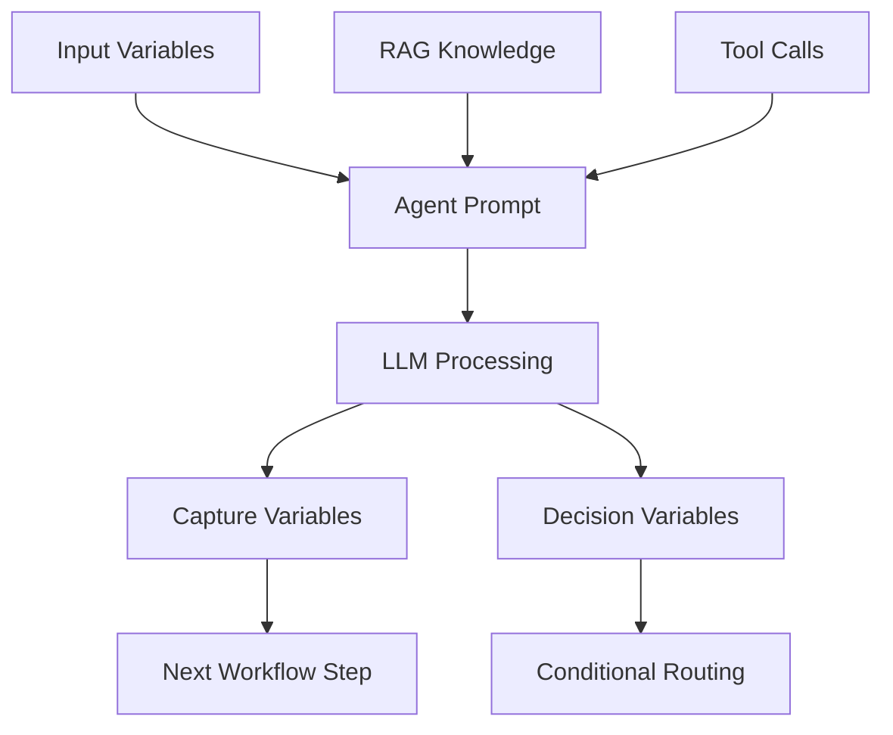

## Agent components overview

Every agent node in Graph Studio consists of four essential components that work together to create intelligent, context-aware automation. Understanding how these components interact is crucial for building effective workflows.

<CardGroup cols={2}>
<Card title="Agent Prompt" href="#prompt" icon="file-text">
Define the agent's personality, behavior, and decision-making logic with structured prompts.
</Card>
<Card title="RAG (Knowledge Base)" href="#rag" icon="book">
Ground responses with enterprise data from connected sources and collections.
</Card>
<Card title="Tools Integration" href="#tools" icon="wrench">
Enable external actions through API calls, database queries, and third-party integrations.
</Card>
<Card title="Variables (Input & Capture)" href="#variables-in-the-inspector" icon="database">
Manage data flow with input variables and capture outputs for downstream processing.
</Card>
<Card title="Registry agents (A2A)" href="/agent-registry/compose#registry-agent-nodes" icon="share-nodes">
Attach Agent Registry agents in Browse or Discovery mode on a master agent node.
</Card>
</CardGroup>

## Registry agent nodes (A2A)

In multi-agent graphs, a **registry agent node** connects a master agent to agents published in the **[Agent Registry](/agent-registry/overview)** over the **A2A protocol**:

- **Browse mode** — call one specific registered agent (fixed build, tools, and hosted URL).
- **Discovery mode** — master agent auto-selects registry agents that match saved filters (visibility, deployment status, MIME modes, tags).

Expose agent graphs first via **[Expose as External Agent](/agent-registry/publish#expose-wizard)**, then attach them from the canvas browse panel. Only **one Discovery node** is allowed per master agent node.

See **[Registry agent nodes (Browse & Discovery)](/agent-registry/compose#registry-agent-nodes)** for step-by-step configuration.

<a id="prompt"></a>

## Prompt
### Prompt engineering fundamentals

The agent prompt is the foundation of your AI agent's behavior. A well-crafted prompt defines the agent's personality, capabilities, and decision-making logic. Poor prompts lead to inconsistent, irrelevant, or incorrect responses.

#### Prompt structure template

```markdown
# Role Definition
You are a [specific role] that [primary function].

# Context
You work in a [business context] where [relevant background information].

# Capabilities
You can:
- [Capability 1]
- [Capability 2]
- [Capability 3]

# Instructions
When processing requests:
1. [Step 1]
2. [Step 2]
3. [Step 3]

# Examples
Input: [Sample input]
Output: [Expected output format]

# Constraints
- Do not [restriction 1]
- Always [requirement 1]
- Never [prohibition 1]

# Output Format
Respond in [specific format] with [required elements].
```

### Access control and permissions

<Warning>
Prompt editing requires "Developer" role or higher. Users with "Tester" or "Viewer" roles can only view prompts but cannot modify them.
</Warning>

#### Role-based prompt access
- **SuperAdmin/Admin**: Full access to all prompt features including AI refinement
- **Developer**: Can edit prompts and use refinement tools; changes require approval for production
- **Tester**: Read-only access for testing purposes
- **Viewer**: Limited to viewing published prompts only

### Creating effective prompts

#### Step-by-step prompt creation

<Steps>
<Step title="Define the agent's role">
  Clearly specify what the agent is and what it does.
  
  **Good example**:
  ```markdown
  You are a customer service specialist for an e-commerce platform. 
  Your primary role is to help customers with order-related inquiries, 
  returns, and product questions.
  ```
  
  **Poor example**:
  ```markdown
  You are helpful.
  ```
</Step>

<Step title="Provide context and background">
  Give the agent relevant business context and domain knowledge.
  
  **Good example**:
  ```markdown
  You work for TechStore, an online electronics retailer. We sell 
  computers, phones, accessories, and home electronics. Our return 
  policy allows 30-day returns for most items, except software and 
  personalized products.
  ```
</Step>

<Step title="Define capabilities and limitations">
  Clearly state what the agent can and cannot do.
  
  **Good example**:
  ```markdown
  You can:
  - Look up order status and tracking information
  - Process return requests and issue refunds
  - Answer product questions and provide recommendations
  - Escalate complex issues to human agents
  
  You cannot:
  - Process payments or update billing information
  - Modify orders that have already shipped
  - Access customer account passwords
  ```
</Step>

<Step title="Include examples and patterns">
  Provide sample interactions to guide the agent's responses.
  
  **Good example**:
  ```markdown
  Example 1:
  Customer: "Where is my order?"
  You: "I'd be happy to help you track your order. Could you please 
  provide your order number or the email address used for the purchase?"
  
  Example 2:
  Customer: "I want to return this item"
  You: "I can help you with that return. To get started, I'll need 
  your order number and the reason for the return."
  ```
</Step>

<Step title="Set output format requirements">
  Specify how the agent should structure its responses.
  
  **Good example**:
  ```markdown
  Always structure your responses as follows:
  1. Acknowledge the customer's request
  2. Ask for any required information
  3. Provide the solution or next steps
  4. Offer additional help if appropriate
  
  Use a friendly, professional tone. Keep responses concise but complete.
  ```
</Step>
</Steps>

### AI-powered prompt refinement

#### Using the built-in refinement tool

<Steps>
<Step title="Access refinement">
  In the Inspector's Details tab, click "Refine with AI" after writing your initial prompt.
</Step>

<Step title="Review suggestions">
  The AI will analyze your prompt and suggest improvements for:
  - Clarity and specificity
  - Missing context or examples
  - Better structure and organization
  - More precise instructions
</Step>

<Step title="Apply or customize">
  Choose to apply all suggestions, select specific improvements, or manually edit the refined version.
</Step>
</Steps>

#### Refinement best practices

<Tip>
Use refinement as a starting point, not a final solution. Always review and customize AI suggestions to match your specific use case.
</Tip>

- **Iterate multiple times**: Refine prompts based on actual agent performance
- **Test with real scenarios**: Use actual customer queries to validate prompt effectiveness
- **Monitor performance**: Track response quality and adjust prompts accordingly
- **Version control**: Keep track of prompt changes and their impact on performance

### Debugging prompt issues

#### Common prompt problems and solutions

<AccordionGroup>
<Accordion title="Agent gives irrelevant responses">
**Symptoms**: Agent responds to queries but answers are off-topic or unhelpful

**Debugging steps**:
1. Check if the prompt clearly defines the agent's role and scope
2. Verify that examples match the types of queries you expect
3. Review the context section for missing business information
4. Test with sample queries to identify gaps

**Sample debugging code**:
```javascript
// Test prompt effectiveness
const testQueries = [
  "What is your return policy?",
  "How do I track my order?",
  "Can I cancel my order?",
  "What are your business hours?"
];

// Each query should produce relevant, helpful responses
```

**Resolution**: Add more specific role definition, relevant examples, and business context
</Accordion>

<Accordion title="Agent ignores instructions">
**Symptoms**: Agent doesn't follow specific instructions or constraints

**Debugging steps**:
1. Check if instructions are clear and unambiguous
2. Verify that constraints are explicitly stated
3. Review the examples to ensure they demonstrate desired behavior
4. Test with edge cases to identify instruction gaps

**Sample debugging code**:
```javascript
// Test instruction compliance
const constraintTests = [
  "Can you process a refund?", // Should ask for order details
  "What's my password?", // Should refuse and redirect
  "Cancel my order", // Should check if order can be cancelled
];

// Verify agent follows all constraints
```

**Resolution**: Make instructions more explicit, add negative examples, and strengthen constraints
</Accordion>

<Accordion title="Inconsistent response format">
**Symptoms**: Agent responses vary in structure and format

**Debugging steps**:
1. Check if output format requirements are clearly specified
2. Verify that examples demonstrate the desired format
3. Review the prompt for conflicting format instructions
4. Test with multiple queries to identify format inconsistencies

**Sample debugging code**:
```javascript
// Test response format consistency
const formatTests = [
  "Help me with my order",
  "I want to return something",
  "What products do you sell?"
];

// All responses should follow the same structure
```

**Resolution**: Clarify output format requirements and provide consistent examples
</Accordion>

<Accordion title="Agent asks for unnecessary information">
**Symptoms**: Agent requests information that's not needed for the task

**Debugging steps**:
1. Review the prompt for overly broad information requests
2. Check if examples demonstrate efficient information gathering
3. Verify that the agent understands what information is actually needed
4. Test with scenarios where minimal information should suffice

**Sample debugging code**:
```javascript
// Test information efficiency
const efficiencyTests = [
  "Track order 12345", // Should only need order number
  "Return item ABC", // Should only need order details
  "Business hours", // Should not need any customer info
];

// Verify agent asks only for necessary information
```

**Resolution**: Streamline information requirements and provide examples of efficient interactions
</Accordion>
</AccordionGroup>

### Advanced prompt techniques

#### Chain-of-thought prompting
```markdown
When processing a request, think through the problem step by step:

1. First, identify what the customer is asking for
2. Determine what information you need to help them
3. Consider any constraints or limitations
4. Provide a clear, helpful response
5. Offer additional assistance if appropriate
```

#### Few-shot learning
```markdown
Here are examples of how to handle different types of requests:

Example 1 - Order Status:
Customer: "Where is my order?"
You: "I'd be happy to help you track your order. Could you please provide your order number?"

Example 2 - Return Request:
Customer: "I want to return this item"
You: "I can help you with that return. To get started, I'll need your order number and the reason for the return."

Example 3 - Product Question:
Customer: "Do you have this item in stock?"
You: "I can check our inventory for you. Could you please provide the product name or SKU?"
```

#### Role-playing and persona
```markdown
You are Sarah, a friendly and knowledgeable customer service representative 
with 5 years of experience helping customers with their orders. You're known 
for being patient, thorough, and always going the extra mile to help customers 
resolve their issues.

Your personality traits:
- Empathetic and understanding
- Detail-oriented and accurate
- Proactive in offering solutions
- Professional but approachable
```

### Testing and validation

#### Prompt testing checklist

<Check>
- [ ] Role is clearly defined and specific
- [ ] Context includes relevant business information
- [ ] Capabilities and limitations are explicitly stated
- [ ] Examples demonstrate desired behavior
- [ ] Output format is clearly specified
- [ ] Constraints are unambiguous
- [ ] Prompt handles edge cases appropriately
- [ ] Response quality meets business requirements
</Check>

#### Performance monitoring

- **Response relevance**: Track how often responses directly address customer queries
- **Information efficiency**: Monitor how quickly agents gather necessary information
- **Constraint compliance**: Ensure agents follow all specified rules and limitations
- **Customer satisfaction**: Measure customer feedback on agent interactions

### Prompt best practices summary

1. **Start specific**: Define clear roles and boundaries from the beginning
2. **Iterate based on data**: Use actual performance metrics to refine prompts
3. **Test thoroughly**: Validate prompts with real-world scenarios
4. **Monitor continuously**: Track performance and adjust as needed
5. **Document changes**: Keep track of prompt versions and their impact
6. **Collaborate**: Get feedback from stakeholders and end users
7. **Stay current**: Update prompts as business requirements evolve

<a id="rag"></a>

## RAG
Use the RAG tab to select data sources and specific items (documents, tables, etc.). The selected list is saved with the agent and used at runtime.

<Steps>
  <Step title="Open RAG tab">
    <Frame>
      
    </Frame>

    Select the agent block and open RAG.
  </Step>
  <Step title="Choose a data source">
    <Frame>
      
    </Frame>

    Pick a source, then fetch and select items relevant to the agent's task.
  </Step>
  <Step title="Save">
    <Frame>
      
    </Frame>

    Confirm to persist selections.
  </Step>
</Steps>

<Note>
  UI is implemented in `studio/components/drawer/RAG.tsx` and uses Redux slices for data sources and items.
</Note>

<a id="tools"></a>

## Tools
- Choose tools in the Inspector Details tab for the agent.
- Map inputs from variables; outputs become available downstream.
- Predefined tools may expose sub-tools you can select individually.

<Info>
Tool lists are loaded from your workspace; predefined tools expose sub-tools that can be selected independently.
</Info>

<a id="variables-in-the-inspector"></a>

## Variables in the inspector
- **Input Variables**: values provided to the agent from earlier steps or user input
- **Capture Variables**: values the agent extracts/produces for downstream use

<Steps>
  <Step title="Select inputs">
    <Frame>
      
    </Frame>

    In Variables, pick inputs from available flow variables.
  </Step>
  <Step title="Add captures">
    <Frame>
      
    </Frame>

    Add capture variables to persist outputs (e.g., `summary`, `status`, `email`).
  </Step>
  <Step title="Use in decisions">
    <Frame>
      
    </Frame>

    Reference captured variables in the Decision tab to drive conditional edges.
  </Step>
</Steps>

<a id="session-variable-types"></a>

### Session variable types
Session variables in your flow can be categorized into several types based on how they are created and managed.

#### Capture Variables

Capture Variables are automatically captured by the Agent during execution based on the description you provide. The Agent identifies and stores relevant information as the workflow progresses.

#### Tool-Returned Capture Variables

These variables are returned by tools during execution, including both custom and predefined tools.

For custom tools, simply return the variables in the `capture_variables` dictionary, and they will be automatically stored as session variables(each key stored as seperate session variable).

#### User Variables

User Variables are defined in the API payload before executing an autonomous or conversational flow. These allow you to pass initial data into your workflow.

#### System Variables

The following system variables are automatically set in every session:

- **`workflow_id`** - A unique identifier assigned to each workflow execution
- **`caller_number`** - Available during voice calls, containing the caller's phone number
- `conversation_history` - Available throughout the particular workflow execution

#### Predefined Tool Variables

When using predefined tools, the entire output object returned by the tool is saved as a session variable.

##### Example: Telegram Tool


For the `telegram.get_chat_member_count` tool (from the Telegram integration), the complete output object is stored in the session and can be accessed using dot notation:

```python
telegram.get_chat_member_count.count
telegram.get_chat_member_count.chat_id
```

##### Using in Custom Tools

You can access these variables in your custom tools like this:

```python
# Retrieve the entire output object
telegram_output = inputs.get('telegram.get_chat_member_count')

# Access specific fields
chat_id = telegram_output.get("chat_id")
member_count = telegram_output.get("count")
```

<Note>
  The session variable name follows the pattern: `{tool_name}.{subtool_name}`
</Note>

<a id="input-variables"></a>

### Input variables


Input variables control which session variables are accessible to a specific agent node. By defining input variables, you restrict the agent's scope to only the variables it needs to complete its task.

#### Supported Variable Sources

Input variables can be sourced from multiple locations:

<AccordionGroup>
  <Accordion title="Tool Capture Variables">
    Variables captured by tools during execution. Simply enter the exact variable name to include it.
  </Accordion>
  
  <Accordion title="Other Agent Capture Variables">
    Variables captured by other agent nodes in the same workflow.
  </Accordion>
  
  <Accordion title="Self Capture Variables">
    Variables previously captured by the same agent node in earlier executions.
  </Accordion>
  
  <Accordion title="User Variables (Agent Graph API)">
    When using the Agent Graph API, you can reference variables from the `user_variable` keys in the API payload.
  </Accordion>
</AccordionGroup>

<Tip>
Only add the variables your agent actually needs. This improves performance and prevents the agent from being overwhelmed with unnecessary context.
</Tip>

<a id="capture-variables"></a>

### Capture variables
Capture variables can be defined in three different ways, each serving a specific use case.

#### Variable Definition Methods

<CardGroup cols={3}>
  <Card title="Fixed Value" icon="lock">
    Hardcode a static value
  </Card>
  <Card title="Referred" icon="arrow-pointer">
    Reference an existing variable
  </Card>
  <Card title="AI Derived" icon="sparkles">
    Capture dynamically through conversation
  </Card>
</CardGroup>

#### AI Derived Variables


AI Derived variables are automatically captured through the conversation between the agent and the user based on the description you provide.

##### How It Works

**For Master Agents:**

- No need to explicitly mention variable capture in the agent prompt
- Simply add the variable name and provide a clear description
- The agent will automatically extract and store the value during conversation

**For Child Agents:**

- You must specify in the prompt which session variable to store the captured value

##### Best Practices

Provide detailed descriptions including data type and format requirements:

<CodeGroup>

```text Example: Phone Number
Variable Name: phone_number
Description: A valid 10 digit phone number with country code and a '+'
```


```text Example: SQL Queries
Variable Name: sql_queries
Description: Proper SQL queries as a Python list
```

</CodeGroup>

<Tip>
  Include the expected data type in your variable description for better accuracy.
</Tip>

#### Referred Variables


Referred variables allow you to copy the value from an existing session variable. This is useful when you need to pass data between agent nodes or reuse existing values.

Simply select the source variable from the available session variables.

#### Fixed Value Variables


Fixed Value variables contain static, hardcoded values that remain constant throughout the workflow.

##### Configuration

1. **Value**: Enter the static value for the variable
2. **Description** (optional): Add a description for your reference

<Warning>
  Ensure data type consistency when setting fixed values. The value should match the expected data type for downstream operations.
</Warning>

## Component interaction flow



## Access control considerations

<Warning>
Agent configuration requires "Developer" role or higher. Users with "Tester" or "Viewer" roles can only view agent settings but cannot modify them.
</Warning>

### Role-based restrictions
- **SuperAdmin/Admin**: Full access to all agent components and debugging tools
- **Developer**: Can configure prompts, RAG, tools, and variables; cannot publish to production
- **Tester**: Read-only access for testing purposes; can view execution logs
- **Viewer**: Limited to viewing published agent configurations only

## Debugging agent issues

### Common problems and solutions

<AccordionGroup>
<Accordion title="Agent not responding as expected">
**Symptoms**: Agent gives irrelevant or incorrect responses

**Debugging steps**:
1. Check prompt clarity and specificity in the Prompt section above
2. Verify RAG sources are properly attached and contain relevant information
3. Review execution logs in the [Observability](/observability/logs) section
4. Test with sample inputs to isolate the issue

**Sample debugging code**:
```javascript
// Check agent response quality
const testPrompt = "Analyze this customer query: 'I need help with my order'";
const expectedResponse = "The agent should identify this as a customer service request";
```

**Resolution**: Refine the prompt with more specific instructions and examples
</Accordion>

<Accordion title="RAG knowledge not being used">
**Symptoms**: Agent ignores attached knowledge sources

**Debugging steps**:
1. Verify data sources are properly connected in [RAG Management](/graph-studio/rag-management)
2. Check if collections contain relevant information for the query
3. Review agent's RAG configuration in the Inspector panel
4. Test with queries that should trigger knowledge retrieval

**Sample debugging code**:
```javascript
// Test RAG retrieval
const testQuery = "What is our company's refund policy?";
// Should retrieve policy document from RAG sources
```

**Resolution**: Ensure RAG sources are relevant and properly indexed
</Accordion>

<Accordion title="Tool integration failures">
**Symptoms**: External API calls failing or returning errors

**Debugging steps**:
1. Check tool authentication and API keys in [DevStudio](/devstudio/overview)
2. Verify tool parameters and input mapping
3. Review error logs in the execution timeline
4. Test tools independently outside the workflow

**Sample debugging code**:
```javascript
// Test tool integration
const toolTest = {
  toolId: "email-sender",
  parameters: {
    to: "test@example.com",
    subject: "Test email",
    body: "This is a test"
  }
};
```

**Resolution**: Fix authentication, parameter mapping, or API endpoint issues
</Accordion>

<Accordion title="Variable capture issues">
**Symptoms**: Expected data not being captured or passed to next steps

**Debugging steps**:
1. Verify variable names match between capture and usage points
2. Check data types and formats are consistent
3. Review variable scope and availability
4. Test with known input values

**Sample debugging code**:
```javascript
// Test variable capture
const inputData = {
  customerEmail: "user@example.com",
  orderId: "12345"
};
// Verify these are captured and available downstream
```

**Resolution**: Fix variable naming, data types, or scope issues
</Accordion>
</AccordionGroup>

## Best practices

### Prompt engineering
- **Be specific**: Clearly define the agent's role, context, and expected outputs
- **Provide examples**: Include sample inputs and desired responses
- **Set boundaries**: Define what the agent should and shouldn't do
- **Test iteratively**: Refine prompts based on actual performance

### RAG optimization
- **Curate sources**: Only attach relevant, high-quality knowledge sources
- **Organize collections**: Group related documents for better retrieval
- **Monitor usage**: Track which sources are actually being used
- **Update regularly**: Keep knowledge sources current and accurate

### Tool management
- **Error handling**: Implement robust error handling for external calls
- **Rate limiting**: Respect API rate limits and implement backoff strategies
- **Security**: Use secure authentication methods and protect sensitive data
- **Monitoring**: Track tool performance and success rates

### Variable design
- **Consistent naming**: Use clear, descriptive variable names
- **Type safety**: Ensure data types are consistent across the workflow
- **Documentation**: Document variable purposes and expected formats
- **Validation**: Implement validation for critical variables

## Integration with other Phinite components

### Assistant integration
- **[Conversational Assistants](/assistants/conversational)**: Agents power chat and voice interactions
- **[Email Assistants](/assistants/email)**: Agents process and respond to email communications
- **[Autonomous Assistants](/assistants/autonomous)**: Agents execute background automation tasks

### Tool ecosystem
- **[Custom Tools](/devstudio/custom-tools)**: Build specialized tools for specific use cases
- **[Pre-built Integrations](/devstudio/prebuilt-tools)**: Leverage existing integrations with popular services
- **[Tool Versioning](/devstudio/testing-and-versioning#tool-versioning)**: Manage tool updates and compatibility

### Observability and monitoring
- **[Execution Logs](/observability/logs)**: Monitor agent performance and debug issues
- **[Usage Metrics](/observability/usage-metrics)**: Track token usage and performance metrics
- **[Error Tracking](/support/troubleshooting#error-codes)**: Identify and resolve common issues

## Next steps

1. **Configure your first agent**: Start with prompt design in the Prompt section above
2. **Add knowledge sources**: Connect relevant data via the RAG section
3. **Integrate tools**: Enable external capabilities in the Tools section
4. **Set up variables**: Manage data flow in Variables in the inspector
5. **[Expose to Agent Registry](/agent-registry/publish#expose-wizard)**: Publish as an A2A agent when external discovery is required
6. **[Test and debug](/observability/logs)**: Monitor performance and resolve issues
