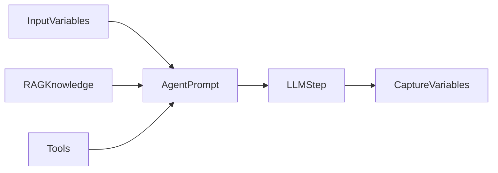

Configure **Master Agent** and **Child Agent** nodes in the [node drawer](/graph-studio/interface).

## Master Agent vs Child Agent

| | **Master Agent** | **Child Agent** |
| --- | --- | --- |
| **Role** | Primary orchestrator | Delegated sub-task |
| **Registry agents** | **Browse** / **Discovery** | Not available |
| **Drawer** | Details, Tools, RAG, Variables, Decision | Same + **Child Variables** |

## Prompt (Details tab)

Define role, context, instructions, constraints, and output format in the **task prompt**. Use **Refine with AI** when available.

| Section | Purpose |
| --- | --- |
| **Role** | What the agent is and its primary job |
| **Context** | Domain background |
| **Instructions** | Step-by-step behavior |
| **Constraints** | What the agent must not do |
| **Output format** | How responses should be structured |

Test with toolbar **Test** after **Save**; refine using [observability logs](/observability/logs).

## Tools tab

1. Click **Add tool** → **Connect Tool** lists **published** tools.
2. Pick tools from [Tools & Dev Studio](/devstudio/overview) or [Integrations](/configure/integrations).
3. Map inputs from [variables](/graph-studio/variables); enable **subtools** for predefined integrations.
4. **Save** the graph.

<Note>
  Unpublished tools show **Publish** in the **Build** dialog.
</Note>

## RAG tab

Attach workspace [RAG Data](/graph-studio/rag-management) collections to this step only — see the **RAG** tab in the drawer.

## Variables tab

Map **Input** and **Capture** variables. Use **Decision** for branching — see [Variables](/graph-studio/variables).

## Registry agents (Master Agent only)

Attach **Browse** (fixed catalog agent) or **Discovery** (filter-matched agents). See [Registry agent nodes](/agent-registry/registry-agent-nodes).

## Configure checklist

1. Add node from toolbar ([Node types](/graph-studio/nodes)).
2. Complete drawer tabs: **Details** → **Tools** → **RAG** → **Variables**.
3. Set **Decision** variables if using [conditional edges](/graph-studio/connections).
4. **Save** the graph.

```mermaid
flowchart LR
  input[InputVariables]
  rag[RAGKnowledge]
  tools[Tools]
  prompt[AgentPrompt]
  llm[LLMStep]
  capture[CaptureVariables]

  input --> prompt
  rag --> prompt
  tools --> prompt
  prompt --> llm
  llm --> capture
```

## Related

- [Graph Studio overview](/graph-studio/overview)
- [RAG Management](/graph-studio/rag-management)
