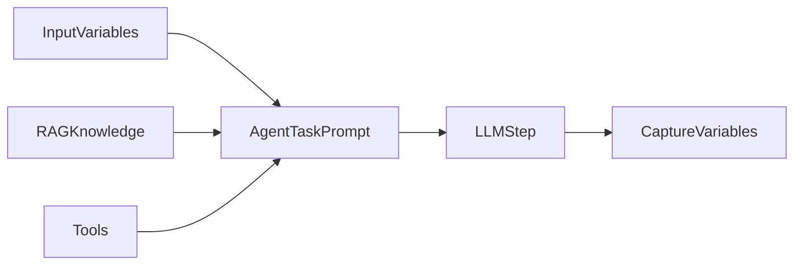

Configure **Master Agent** and **Child Agent** nodes in the [node drawer](/graph-studio/interface). Double-click a node to open the panel.

## Master Agent vs Child Agent

| | **Master Agent** | **Child Agent** |
| --- | --- | --- |
| **Role** | Primary orchestrator | Delegated sub-task |
| **Canvas label** | **Master Agent** | **Child Agent** |
| **Registry agents** | **Browse** / **Discovery** when available | Not available |
| **Drawer tabs** | Details, RAG, Tools, Variables | Same |
| **Details extras** | Orchestration Model + Agent Task Prompt | **Purpose of this child agent** + Agent Task Prompt |

On the canvas, Master agents use the `task` node type; Child agents use `child`. Both open the same four drawer tabs.

## Details tab

1. Set **Orchestration Model** (for example `gpt-4.1` or `gemini-2.5-pro`).
2. Write the **Agent Task Prompt** in Markdown (or switch to **Formatted**).
3. Use **Refine Prompt** when you want Aura-assisted edits.
4. On Child Agents, fill **Purpose of this child agent** (short summary shown on the node).

Structure the prompt with clear mission, responsibilities, and output expectations — the editor is freeform Markdown, not fixed Role/Context fields.

<Frame caption="Master Agent — Details tab">
  
</Frame>

Test with toolbar **Test** after **Save**; refine using [observability logs](/observability/logs).

## Tools tab

1. Open **Tools** → **Add a new tool**.
2. Choose from the panel tabs:
   - **Tools** — workspace tools from [Tools & Dev Studio](/devstudio/overview)
   - **Integrations** — [Integrations Hub](/integrations-hub/overview) apps
   - **MCP Servers** — MCP connections (**+ Add** if none installed)
3. Map inputs from [variables](/graph-studio/variables).
4. **Save** the graph.

Specialized tools often sit on Child Agents; the Master Agent may hold orchestration tools (for example `search_repositories`) or none.

<Frame caption="Child Agent — Tools tab">
  
</Frame>

<Frame caption="Add a new tool — workspace catalog">
  
</Frame>

<Note>
  Unpublished tools show **Publish** in the **Build Agent** dialog.
</Note>

## RAG tab

RAG data sources give the agent contextual knowledge beyond the base model. Use **Attach Files** (or attach collections from [RAG Management](/graph-studio/rag-management)) for this step only.

<Frame caption="RAG tab — Attach Files">
  
</Frame>

## Variables tab

- **Input Variables** — values passed into the step (triggers, APIs, upstream).
- **Capture Variables** — fields the model extracts for later steps (**Create a variable**).

See [Variables](/graph-studio/variables).

## Registry agents (Master Agent only)

Attach **Browse** (fixed catalog agent) or **Discovery** (filter-matched agents) when your workspace supports registry nodes. See [Registry agent nodes](/agent-registry/registry-agent-nodes).

## Configure checklist

1. Add node from the canvas palette ([Node types](/graph-studio/nodes)).
2. Complete drawer tabs: **Details** → **Tools** → **RAG** → **Variables**.
3. Label outbound edges for branches ([Connections](/graph-studio/connections)).
4. **Save** the graph.

```mermaid
flowchart LR
  input[InputVariables]
  rag[RAGKnowledge]
  tools[Tools]
  prompt[AgentTaskPrompt]
  llm[LLMStep]
  capture[CaptureVariables]

  input --> prompt
  rag --> prompt
  tools --> prompt
  prompt --> llm
  llm --> capture
```

## Related

- [Graph Studio overview](/graph-studio/overview)
- [Interface](/graph-studio/interface)
- [RAG Management](/graph-studio/rag-management)
