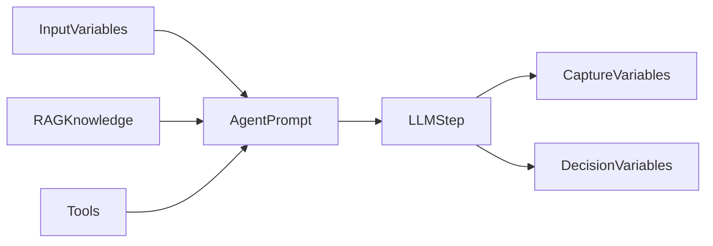

Every **Master Agent** and **Child Agent** node combines four core drawer areas plus optional **Browse** / **Discovery** registry attachments.

<CardGroup cols={2}>
  <Card title="Agent prompt" icon="file-lines" href="/graph-studio/agent-node/prompt">
    Task prompt and behavior in **Details**.
  </Card>
  <Card title="RAG" icon="book" href="/graph-studio/agent-node/rag">
    Attach [RAG Data](/graph-studio/rag-management) collections per node.
  </Card>
  <Card title="Tools" icon="wrench" href="/graph-studio/agent-node/tools">
    Published tools and integrations for this step.
  </Card>
  <Card title="Variables" icon="database" href="/graph-studio/agent-node/variables">
    Input and capture variables for the step.
  </Card>
  <Card title="Registry agents (A2A)" icon="share-nodes" href="/agent-registry/registry-agent-nodes">
    **Browse** or **Discovery** on a Master Agent node.
  </Card>
</CardGroup>

## How components interact

```mermaid
flowchart LR
  input[InputVariables]
  rag[RAGKnowledge]
  tools[Tools]
  prompt[AgentPrompt]
  llm[LLMStep]
  capture[CaptureVariables]
  decision[DecisionVariables]

  input --> prompt
  rag --> prompt
  tools --> prompt
  prompt --> llm
  llm --> capture
  llm --> decision
```

## Configure an agent node

1. Select a **Master Agent** or **Child Agent** on the canvas.
2. Complete drawer tabs: **Details** → **Tools** → **RAG** → **Variables**.
3. For branching, set **Decision** variables before [conditional edges](/graph-studio/connections/conditional-edges).
4. On Master Agents, optionally attach [registry agents](/agent-registry/registry-agent-nodes).
5. **Save** the graph.

<Note>
  Node configuration requires appropriate workspace permissions (typically Developer role or higher). See [User roles](/user-management/user-roles).
</Note>

## Related

- [Inspector (node drawer)](/graph-studio/interface/inspector-panel)
- [Node types](/graph-studio/nodes)
- [Graph Studio overview](/graph-studio/overview)
