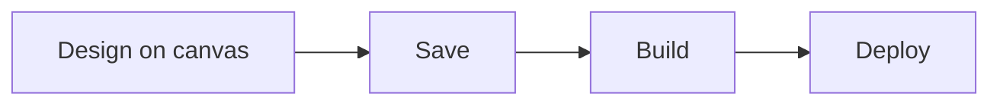

**Graph Studio** is where you design an **Agent Graph** — connect nodes, configure the **node drawer**, and use the toolbar to **Save**, **Build**, **Deploy**, and **Test**. **Phinite Aura** (left sidebar) can generate or edit the graph from chat.

<CardGroup cols={2}>
  <Card title="Methods" icon="sparkles" href="/graph-studio/methods">
    Phinite Aura or manual canvas.
  </Card>
  <Card title="Interface" icon="layout" href="/graph-studio/interface">
    Canvas, toolbar, drawer, graph assets.
  </Card>
  <Card title="Nodes" icon="diagram-project" href="/graph-studio/nodes">
    Start, Master, Child, Tool, End, registry agents.
  </Card>
  <Card title="Variables" icon="database" href="/graph-studio/variables">
    Graph, input, capture, and session variables.
  </Card>
  <Card title="Connections" icon="arrow-right" href="/graph-studio/connections">
    Handles, edges, conditional branches.
  </Card>
  <Card title="Agent configuration" icon="robot" href="/graph-studio/agent-node">
    Prompt, tools, RAG, variables.
  </Card>
  <Card title="RAG" icon="book" href="/graph-studio/rag-management">
    Workspace collections and node attachment.
  </Card>
  <Card title="Publishing" icon="hammer" type="note" href="/graph-studio/publishing">
    Save → Build → Deploy.
  </Card>
</CardGroup>

## Open Graph Studio

1. From **Workspace Home**, open an existing **Agent Graph** or click **New Agent Graph**.
2. Enter name and description; choose **Conversational** or **Autonomous** ([Agents overview](/agents/overview)).
3. Click **Create** — Studio opens on the canvas (often with **Phinite Aura** chat open).

<Frame caption="New Agent Graph dialog">
  
</Frame>

<Note>
  Workspace filters may still show an **Email** chip. New graphs only offer **Conversational** and **Autonomous**.
</Note>

## Studio layout (summary)

| Area | What it does |
| --- | --- |
| **Left sidebar** | **Phinite Aura**, plus **Graph assets** — Versions, Builds, Cards, Triggers, Integrations, Tools |
| **Canvas** | Add and connect nodes; floating node palette and zoom controls |
| **Node drawer** | Per-node **Details**, **RAG**, **Tools**, **Variables** — **Add a new tool** opens Tools / Integrations / MCP |
| **Toolbar** | **Save** → **Build** → **Deploy** → **Test** (**Deploy** opens Deploy as A2A / Channel / Chat API when builds exist) |

<Frame caption="Graph Studio — canvas, graph assets, and toolbar">
  
</Frame>

See [Interface](/graph-studio/interface) for canvas, toolbar, and drawer detail.

## Golden path

1. Create or open a graph ([Methods](/graph-studio/methods)).
2. Add [nodes](/graph-studio/nodes) and [connections](/graph-studio/connections).
3. Configure [agent nodes](/graph-studio/agent-node) and [variables](/graph-studio/variables).
4. Attach [RAG](/graph-studio/rag-management) where needed.
5. **Save**, then [Build and deploy](/graph-studio/publishing).

## Graph assets (sidebar)

| Asset | Purpose |
| --- | --- |
| **Graph Versions** | Saved design snapshots |
| **Agent Builds** | Pinned builds from **Build** |
| **Agent Cards** | A2A exposure |
| **Triggers** | Graph-scoped triggers |
| **Integrations** | Graph-scoped channels and tools |
| **Tools** | Graph-scoped tool list |

## Related

- [Tools & Dev Studio](/devstudio/overview)
- [Configure integrations](/configure/integrations)
- [Builds overview](/builds/overview)
