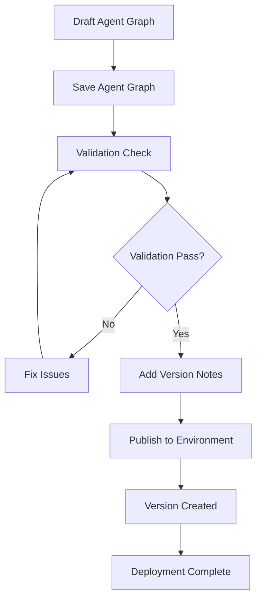

## Publishing overview

Agent Graph publishing in Phinite provides enterprise-grade deployment capabilities with full version control, access management, and observability. Understanding the publishing process is crucial for maintaining stable, secure, and auditable workflows.

### Publishing workflow



## Access control and permissions

<Warning>
  Publishing flows requires "Admin" or "SuperAdmin" role. Users with "Developer" role can save flows but cannot publish them to production environments.
</Warning>

### Role-based publishing permissions

| Role | Can Save Agent Graphs | Can Publish to Dev | Can Publish to UAT | Can Publish to Prod |
| --- | --- | --- | --- | --- |
| **SuperAdmin** | ✅ | ✅ | ✅ | ✅ |
| **Admin** | ✅ | ✅ | ✅ | ✅ |
| **Developer** | ✅ | ✅ | ❌ | ❌ |
| **Tester** | ❌ | ❌ | ❌ | ❌ |
| **Viewer** | ❌ | ❌ | ❌ | ❌ |

### Environment-specific access

- **Development**: All users with "Developer" role or higher
- **UAT**: Requires "Admin" role for publishing
- **Production**: Requires "Admin" or "SuperAdmin" role with additional approval workflows

## Pre-publishing checklist

### Agent Graph validation requirements

<Check>
  - Agent Graph is saved successfully
  - All required node fields are filled
  - Agent prompts are complete and tested
  - RAG sources are properly connected
  - Tool integrations are configured
  - Variables are properly mapped
  - Conditional edges have valid logic
  - Agent Graph has clear Start and End nodes
  - No orphaned nodes or disconnected components
</Check>

### Common validation failures

<AccordionGroup>
  <Accordion title="Missing required fields">
    **Error**: "Please fill all required details for the following nodes: agent, tool"

    **Debugging steps**:

    1. Check each node in the Inspector panel
    2. Verify all required fields are populated
    3. Look for red validation indicators

    **Resolution**: Fill all required fields and re-validate
  </Accordion>

  <Accordion title="Invalid connections">
    **Error**: "Agent Graph contains invalid connections or orphaned nodes"

    **Debugging steps**:

    1. Check for nodes without proper connections
    2. Verify Start node has outgoing connections (Max one)
    3. Ensure End nodes have incoming connections
    4. Look for disconnected nodes in the canvas (Except the child nodes)

    **Resolution**: Connect all nodes properly and ensure graph integrity
  </Accordion>

  <Accordion title="Tool integration errors">
    **Error**: "Tool integration failed validation"

    **Debugging steps**:

    1. Verify API keys and credentials
    2. Review tool parameter mapping

    **Resolution**: Fix tool configuration and authentication
  </Accordion>
</AccordionGroup>

## Publishing process


### Step-by-step publishing

<Steps>
  <Step title="Save your flow">
    Click "Save" in the studio header to persist your changes.

    <Check>
      You should see a success message confirming the flow is saved.
    </Check>
  </Step>
  <Step title="Run validation">
    The system automatically validates your flow before publishing.

    <Warning>
      If validation fails, you'll see specific error messages indicating what needs to be fixed.
    </Warning>
  </Step>
  <Step title="Add version details">
    Provide a clear description of changes in this version.

    **Good version notes**:

    ```markdown
    Version 2.1.0 - Customer Service Agent Graph
    - Added RAG integration for policy knowledge
    - Improved error handling for payment failures
    - Updated email templates for better customer experience
    - Fixed issue with order lookup timeout
    ```

    **Poor version notes**:

    ```markdown
    Updated stuff
    ```
  </Step>
  <Step title="Select target environment">
    Choose the appropriate environment for deployment.

    <Note>
      Production deployments may require additional approval workflows depending on your organization's policies.
    </Note>
  </Step>
  <Step title="Confirm and publish">
    Review all settings and confirm the publication.

    <Check>
      You should see a success message and the new version in the version history.
    </Check>
  </Step>
</Steps>

## Version management

### Version history interface

The version history panel provides comprehensive version management:

- **Version list**: View all published versions with timestamps and notes
- **Version details**: Inspect specific version configurations
- **Copy to draft**: Create a new draft based on any published version
- **Environment status**: See which environments each version is deployed to

### Version numbering

Phinite automatically manages version numbers:

- **First published version**: Starts at version 1
- **Subsequent versions**: Incrementally numbered (2, 3, 4, etc.)
- **Draft versions**: Not numbered until published (default 0)
- **Version notes**: Required for all published versions

### Copying versions to draft

<Steps>
  <Step title="Access version history">
    Click "Version History" in the studio sidebar.
  </Step>
  <Step title="Select source version">
    Choose the version you want to copy from the list.
  </Step>
  <Step title="Copy to draft">
    Click "Copy to Draft" and confirm the action.
  </Step>
  <Step title="Edit and republish">
    Make your changes and publish as a new version.
  </Step>
</Steps>

## Post-publishing monitoring

### Build verification

<Steps>
  <Step title="Check Build with particular agent graph version">
    Verify the agent graph is connected to target build and build is connected to the desired environment.
  </Step>
  <Step title="Test flow execution">
    Run test scenarios to ensure the flow works as expected.
  </Step>
  <Step title="Monitor performance">
    Use [Observability](/observability/overview) tools to track flow performance.
  </Step>
  <Step title="Review logs">
    Check [execution logs](/observability/logs) for any issues or errors.
  </Step>
</Steps>

### Performance monitoring

- **Execution success rate**: Track how often flows complete successfully
- **Response times**: Monitor flow execution duration
- **Error rates**: Identify common failure points. Work on prompt or changing models.
- **Resource usage**: Track token consumption and API calls

## Best practices

### Version management

- **Descriptive notes**: Always provide clear, actionable version descriptions
- **Incremental changes**: Make small, focused changes rather than large overhauls
- **Testing**: Thoroughly test flows before publishing to production
- **Rollback plan**: Keep previous versions available for quick rollback

### Security considerations

- **Access control**: Regularly review who has publishing permissions
- **Environment isolation**: Maintain strict separation between environments
- **Audit trails**: Monitor all publishing activities for compliance
- **Secret management**: Ensure sensitive data is properly secured

### Performance optimization

- **Efficient flows**: Design flows for optimal performance and resource usage
- **Monitoring**: Set up alerts for performance degradation
- **Scaling**: Plan for increased load and usage patterns
- **Optimization**: Continuously optimize based on performance data

## Integration with other components

### Assistant integration

- [**Conversational Assistants**](/assistants/conversational): Deploy flows for chat and voice interactions
- [**Email Assistants**](/assistants/email): Publish flows for email automation
- [**Autonomous Assistants**](/assistants/autonomous): Deploy background automation flows

### Observability integration

- [**Execution Logs**](/observability/logs): Monitor published flow performance
- [**Usage Metrics**](/observability/usage-metrics): Track flow usage and performance
- [**Error Tracking**](/support/error-codes): Identify and resolve issues

### Environment management

- [**Build Configuration**](/builds/configuration): Configure deployment settings
- [**Lifecycle**](/builds/lifecycle): Recommended testing and deployment flow