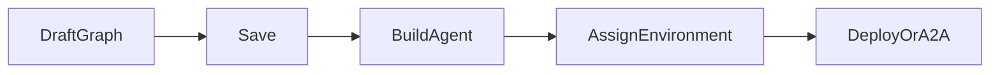

Publishing an **Agent Graph** means moving from an editable **draft** to pinned **builds** — not a single "Publish" button on the canvas.

## Workflow

1. **Design** in [Graph Studio](/graph-studio/overview) — **Save** the draft.
2. Click **Build** — the **Build Agent** dialog validates the graph and lists associated tools (and RAG).
3. Add an optional description, confirm tools (use **Publish** on unpublished tools), then **Create Build**.
4. **Assign** the build to DEV / UAT / PROD ([Environments](/builds/environments)).
5. **Deploy** or **Expose as A2A** ([Deploy](/agents/deploy), [Agent Registry](/agent-registry/overview)).

<Frame caption="Build Agent — pin graph and tool versions">
  
</Frame>

```mermaid
flowchart LR
  draft[DraftGraph]
  save[Save]
  build[BuildAgent]
  env[AssignEnvironment]
  deploy[DeployOrA2A]

  draft --> save --> build --> env --> deploy
```

<Note>
  **Save** updates the working draft. **Build** creates an immutable **Agent Build**. **Deploy** stays disabled until a build exists.
</Note>

## Build Agent dialog

| Section | What you do |
| --- | --- |
| **Description** | Optional note stored with the build (0/500) |
| **Agent Graph** | Confirms graph name, type (Conversational / Autonomous), last saved |
| **Tools Associated** | Select tools to pin; **Publish** unfinished tools before create |
| **RAG Associated** | Expand to include attached RAG data |

While preparing, the UI shows progress: validating graph → packaging tools → creating snapshot → finalizing.

## Graph versions and Agent Builds

**Graph Versions** in the Studio sidebar stores saved design snapshots. Compare changes or roll back before creating a new build.

**Agent Builds** lists immutable builds for the open graph, including **Environment assignments** (**DEV**, **UAT**, **PROD**). Each row shows tool / RAG counts and status. Use **Assign** to map a build to an environment, then **Deploy**.

<Frame caption="Agent Builds — DEV / UAT / PROD assignments">
  
</Frame>

## Permissions

| Action | Typical minimum role |
| --- | --- |
| Edit graph | Developer |
| Create build | Developer |
| Deploy to production | Admin / SuperAdmin (varies) |

See [User roles](/user-management/user-roles).

## Related

- [Graph Studio overview](/graph-studio/overview)
- [Build lifecycle](/builds/lifecycle)
- [Build export](/configure/build-export)
