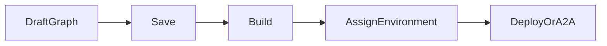

Publishing an **Agent Graph** means moving from an editable **draft** to pinned **builds** — not a single "Publish" button on the canvas.

## Workflow

1. **Design** in [Graph Studio](/graph-studio/overview) — **Save** the draft.
2. **Build** from the toolbar — pins graph + tool versions ([Builds overview](/builds/overview)).
3. **Assign** the build to DEV / UAT / PROD ([Environments](/builds/environments)).
4. **Deploy** or **Expose as A2A** ([Deploy](/agents/deploy), [Agent Registry](/agent-registry/overview)).

<Frame caption="Build dialog — pin Agent Graph and tool versions">
  
</Frame>

```mermaid
flowchart LR
  draft[DraftGraph]
  save[Save]
  build[Build]
  env[AssignEnvironment]
  deploy[DeployOrA2A]

  draft --> save --> build --> env --> deploy
```

<Note>
  **Save** updates the working draft. **Build** creates an immutable **Agent Build** for deploy and A2A.
</Note>

## Graph versions

**Graph Versions** in the Studio sidebar stores saved snapshots. Compare changes or roll back design work before creating a new build.

## Permissions

| Action | Typical minimum role |
| --- | --- |
| Edit graph | Developer |
| Create build | Developer |
| Deploy to production | Admin / SuperAdmin (varies) |

See [User roles](/user-management/user-roles).

## Related

- [Graph Studio overview](/graph-studio/overview)
- [Build lifecycle](/builds/lifecycle)
- [Build export](/configure/build-export)
