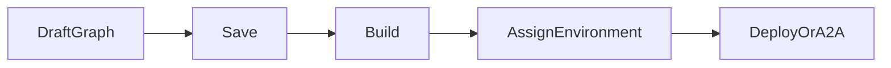

Publishing an **Agent Graph** in Phinite means moving from a editable **draft** to pinned **builds** and environment assignment — not a single "Publish" button on the canvas.

<CardGroup cols={2}>
  <Card title="Save" icon="floppy-disk" href="/graph-studio/overview">
    Persist the draft graph from the Studio toolbar.
  </Card>
  <Card title="Build" icon="hammer" href="/builds/overview">
    Freeze graph + tool versions into an Agent Build.
  </Card>
  <Card title="Deploy" icon="rocket" href="/agents/deploy">
    Assign builds to channels, triggers, or A2A.
  </Card>
  <Card title="Graph Versions" icon="clock-rotate-left" href="/graph-studio/overview">
    Saved snapshots from the Studio sidebar.
  </Card>
</CardGroup>

## Recommended workflow

1. **Design** in [Graph Studio](/graph-studio/overview) — nodes, drawer config, **Save**.
2. **Build** from the toolbar — pins graph and tool versions ([Builds overview](/builds/overview)).
3. **Assign** the build to DEV / UAT / PROD ([Environments](/builds/environments)).
4. **Deploy** or **Expose as A2A** ([Deploy](/agents/deploy), [Agent Registry](/agent-registry/overview)).

<Frame caption="Build dialog — pin Agent Graph and tool versions">
  
</Frame>

```mermaid
flowchart LR
  draft[DraftGraph]
  save[Save]
  build[Build]
  env[AssignEnvironment]
  deploy[DeployOrA2A]

  draft --> save --> build --> env --> deploy
```

<Note>
  **Save** updates the working draft. **Build** creates an immutable **Agent Build** used for deploy and A2A exposure.
</Note>

## Permissions

| Action | Typical minimum role |
| --- | --- |
| Edit graph in Studio | Developer |
| Create build | Developer (permission `workspace.agent_builds.create_new_build`) |
| Deploy to production | Admin / SuperAdmin (varies by workspace policy) |

See [User roles](/user-management/user-roles) for your workspace.

## Graph versions (sidebar)

**Graph Versions** in the Studio sidebar stores saved snapshots of the graph. Use versions to compare changes or roll back design work before creating a new build.

## Related

- [Graph Studio overview](/graph-studio/overview)
- [Build lifecycle](/builds/lifecycle)
- [Configuration export](/configure/build-export)
