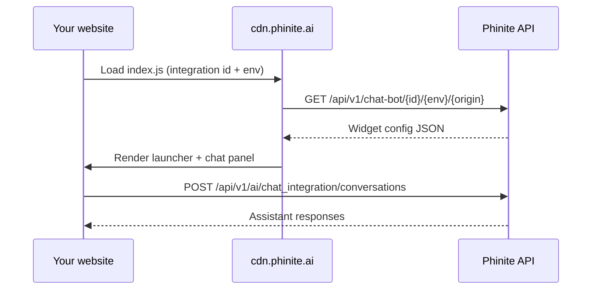

The **Chat (AI)** channel deploys a conversational assistant on your website via an embeddable widget. Configure appearance, allowed origins, and per-environment settings in the workspace, then paste a single script tag into your site.

<Note>
  This is a **channel** (where users talk to your assistant), not a predefined tool. The widget is built from `flow-gen-frontend/scripts/index.js` and served from Phinite's CDN.
</Note>

---

## Overview

| Piece | Role |
| --- | --- |
| **Workspace UI** | Create configurations, style the widget, assign assistants, copy the embed script |
| **Embed script** | Loads from CDN; reads `data-integration-id` and `data-company-env` |
| **Config API** | Returns styling and copy for the current page origin |
| **Conversation API** | Starts and continues chat sessions with your assistant |

When a visitor loads your page, the script fetches configuration for the integration ID, environment, and page origin. The widget **does not render** until that request succeeds — so allowed origins must be configured before the widget appears.

---

## Create a configuration

<Steps>
  <Step title="Open Integrations → Channels → Chatbot">
    In your workspace, go to **Integrations**, open the **Channels** section, and select **Chatbot** (Chat AI).
  </Step>
  <Step title="Add a configuration">
    Click **+ Add Configuration**, name it, and save.
  </Step>
  <Step title="Assign assistants">
    Under **For Workspace assistants**, select the conversational assistants that should receive traffic from this widget.
  </Step>
  <Step title="Configure each environment">
    Use the **Development**, **UAT**, and **Production** tabs. Each environment has its own widget settings and embed script.
  </Step>
  <Step title="Add allowed origin URLs">
    In **Allowed Origin URLs**, add every site origin where the widget may load (e.g. `https://www.example.com`). The widget validates the browser origin against this list.
  </Step>
  <Step title="Customize and save">
    Set agent details, placement, and appearance (see below). Save the configuration.
  </Step>
  <Step title="Copy the embed script">
    Open the **Installation** section and copy the generated `<script>` tag for the active environment tab.
  </Step>
</Steps>

---

## Embed the widget

Paste the script before the closing `</body>` tag on pages where the chat should appear.

```html
<script
  src="https://cdn.phinite.ai/website/prod/index.js"
  data-integration-id="YOUR_INTEGRATION_ID"
  data-company-env="production"
></script>
```

### Script attributes

| Attribute | Required | Values |
| --- | --- | --- |
| `src` | Yes | CDN URL for the target Phinite environment (see table below) |
| `data-integration-id` | Yes | Integration ID from the Phinite configuration (shown in **Installation**) |
| `data-company-env` | Yes | `development`, `uat`, or `production` — must match the environment tab you configured |

### CDN script URLs

| Phinite environment | Widget script URL | `data-company-env` |
| --- | --- | --- |
| Development | `https://cdn.phinite.ai/website/dev/index.js` | `development` |
| UAT / Staging | `https://cdn.phinite.ai/website/staging/index.js` | `uat` |
| Production | `https://cdn.phinite.ai/website/prod/index.js` | `production` |

The workspace **Installation** panel generates the correct `src` and `data-company-env` for the environment tab you are editing.

---

## Configuration sections

Each environment tab (Development, UAT, Production) stores independent settings.

### Allowed origin URLs

Origins where the widget is permitted to load. Add full origins including scheme:

- `https://www.example.com`
- `https://app.example.com`

If the page origin is not listed, the config API rejects the request and the widget stays hidden.

### Agent details

| Field | Description |
| --- | --- |
| **Agent name** | Title shown in the widget header (max 30 characters) |
| **Description** | Welcome / subtitle text in the chat panel (max 90 characters) |
| **Banner image** | Large welcome image in the empty chat state |
| **Launcher text** | Label on expanded launcher styles (pill buttons) |

### Placement

| Field | Description |
| --- | --- |
| **Modality** | **Widget** (floating launcher). Embedded inline mode is not yet available. |
| **Position** | `bottom-left` or `bottom-right` |
| **Left / right margin** | Horizontal offset from the screen edge (px) |
| **Bottom margin** | Vertical offset from the bottom of the viewport (px) |

### Appearance and style

| Field | Description |
| --- | --- |
| **Brand color** | Primary accent — header, buttons, launcher |
| **Brand secondary color** | Secondary accent for launcher backgrounds |
| **Bubble color** | Assistant message bubble background |
| **Bubble text tightness** | `tight`, `normal`, or `relaxed` line height |
| **Bubble padding** | Inner padding for message bubbles (6–24 px) |
| **Bubble border radius** | Corner radius for bubbles (2–30 px) |
| **Bubble shadow** | `none`, `soft`, or `medium` |
| **Corner radius** | Overall widget panel corner radius |
| **Header image** | Logo in the chat header bar |
| **Agent image** | Avatar beside assistant messages |
| **Launcher image** | Icon on the floating launcher button |

### Launcher type

Three launcher styles are available:

| Type | Appearance |
| --- | --- |
| **0 — Circle** | Round FAB with launcher image |
| **1 — Pill with icon** | Rounded pill with image + launcher text |
| **2 — Pill text only** | Rounded pill with launcher text only |

---

## How the widget loads at runtime



1. The script reads `data-integration-id` and `data-company-env` from the `<script>` tag.
2. It calls `GET /api/v1/chat-bot/{integrationId}/{env}/{origin}` with the page's `window.location.origin`.
3. On success, it applies branding, placement, and copy from the response.
4. User messages go to `POST /api/v1/ai/chat_integration/conversations`.

---

## Per-environment workflow

Configure and test in order:

1. **Development** — embed on a local or staging site; verify allowed origins and assistant routing.
2. **UAT** — mirror production settings; run acceptance tests with stakeholders.
3. **Production** — deploy the production script URL and `data-company-env="production"` to your live site.

Each tab produces a **different embed script**. Do not mix a development script with production assistant builds.

---

## Best practices

- Add allowed origins **before** testing — the widget silently fails to render if the origin is missing.
- Use separate configurations or environment tabs for dev, staging, and production sites.
- Match the embed script environment to the assistant **build** deployed in that environment.
- Upload PNG or JPEG logos; keep header and agent images square-friendly for best cropping.
- Test on mobile — the widget expands to full-screen on small viewports.

---

## Troubleshooting

| Symptom | Likely cause |
| --- | --- |
| Widget never appears | Origin not in **Allowed Origin URLs**, or config not saved |
| Widget appears but no replies | Assistant not assigned to this configuration, or no build deployed for that environment |
| Wrong branding | Wrong environment tab saved, or cached script from another env |
| Script copied but empty | Configuration not saved yet — save first, then copy from **Installation** |

Check browser devtools → Network for failures on `/api/v1/chat-bot/...`.

---

## Related topics

- [Channels overview](/integrations-hub/channels/overview)
- [Web Chat](/integrations-hub/channels/webchat) — alias for this channel
- [Conversational assistants](/assistants/conversational)
- [Intents](/triggers-intents/intents) — how chat messages route to agent graphs
- [Observability logs](/observability/logs) — debug live conversations
