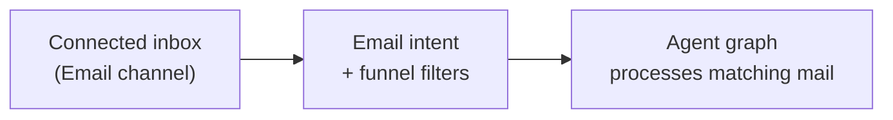

The **Email** channel connects a workspace inbox (Gmail or Outlook) to your email assistants. After the channel is configured under **Integrations → Channels**, you attach it to **email intents** and use **Funnel Down the Emails** filters to decide which messages trigger each agent graph.

<Note>
  The channel stores credentials and verifies the inbox. **Filters** live on each email intent — they narrow which messages from that inbox match a specific intent.
</Note>

---

## How channel and intents work together

| Layer | Where you configure it | Purpose |
| --- | --- | --- |
| **Email channel** | Integrations → Channels → Email | Connect Gmail or Outlook per environment |
| **Integration funnel** | Email intent → Integration Funnel | Pick which inbox connection this intent listens to |
| **Funnel filters** | Email intent → Funnel Down the Emails | Match sender, recipient, subject, body, attachments, size, or date |
| **Agent graph** | Email intent → Agent Graph to Trigger | Workflow that runs when filters match |

One inbox can feed multiple intents — each intent uses different filters to route mail to the right graph.

---

## Connect the email channel

<Frame>
  
</Frame>

<Steps>
  <Step title="Open Integrations → Channels → Email">
    In your workspace sidebar, go to **Integrations**, open **Channels**, and select **Email**.
  </Step>
  <Step title="Add a configuration">
    Click **+ Add Configuration**, name it, and choose **Gmail** or **Outlook**.
  </Step>
  <Step title="Configure per environment">
    Set credentials separately for **Development**, **UAT**, and **Production**. Verify each environment before saving.
  </Step>
  <Step title="Assign assistants">
    Select the email assistants that may use this inbox connection.
  </Step>
  <Step title="Save">
    The configuration appears in the **Integration Funnel** dropdown when you create email intents.
  </Step>
</Steps>

### Gmail

- Email address and **App Password** (with 2-Step Verification enabled on the Google account)
- Verify credentials in the UI before promoting to the next environment

### Outlook

- **OAuth 2.0** — sign in with Microsoft (recommended)
- **Graph app credentials** — Client ID, Client Secret, Tenant ID for app-only access
- **IMAP** — email and password with app-specific authentication where required

<Tip>
  Use separate channel configurations for Dev, UAT, and Prod inboxes. Match the environment tab on the intent to the build you deploy.
</Tip>

---

## Funnel Down the Emails (intent filters)

After the channel is connected, open your **email assistant** → **Build** → **Intents** → create or edit an intent.

In the intent drawer, the **Funnel Down the Emails** section lets you add rules so only matching messages run this intent's agent graph. Click **Add Filter** and choose from **Basic** or **Advanced** filters.

### Basic filters

| Filter | What it matches |
| --- | --- |
| **Email to** | Recipient address(es) — useful for shared inboxes (`support@`, `billing@`) |
| **Email from** | Sender address(es) — route mail from known domains or VIP senders |

You can add multiple **Email to** or **Email from** values. Any listed address can match within that filter group.

### Advanced filters

| Filter | What it matches |
| --- | --- |
| **Subject** | Subject line — see match types below |
| **Has Attachment** | Whether the message includes attachments (`Yes` / `No`) |
| **Size** | Message size compared to a threshold (bytes, KB, or MB) |
| **Body Contains** | Text that must appear in the email body |
| **Body Excludes** | Text that must **not** appear in the email body |
| **Date** | Received or sent date relative to a chosen day |

#### Subject match types

| Type | Behavior |
| --- | --- |
| **Contains** | Subject includes the text |
| **Equals** | Subject matches exactly |
| **Starts With** | Subject begins with the text |
| **Ends With** | Subject ends with the text |
| **Regex Pattern** | Subject matches a regular expression |

#### Size comparisons

**Larger than**, **Smaller than**, **Equals**, **Larger than or equal**, **Smaller than or equal** — combined with a size in bytes, KB, or MB.

#### Date comparisons

Compare **received** or **sent** date **after**, **before**, or **on** a selected date.

---

## Filter logic

When you save an intent, filters are combined as follows:

- **Advanced filters** on the same intent are **AND**ed together — a message must satisfy every advanced rule you add (subject + attachment + body, etc.).
- **Email to** and **Email from** values are included in the same filter group as the advanced criteria when saved together.
- Use **separate intents** when you need **OR** routing (e.g. `support@` → Support graph, `sales@` → Sales graph).

<Card title="Example: support triage">
  **Intent:** Support requests

  - **Email to:** `support@company.com`
  - **Subject:** Contains `urgent`
  - **Body Excludes:** `out of office`
  - **Integration funnel:** Production support inbox
  - **Agent graph:** Triage and reply flow

  Only mail to the support address with "urgent" in the subject — and without an auto-reply phrase — triggers this graph.
</Card>

---

## Complete email intent setup

<Steps>
  <Step title="Connect the channel">
    Finish [email channel setup](#connect-the-email-channel) for the target environment.
  </Step>
  <Step title="Create an email intent">
    Assistant → **Build** → **Intents** → **New Intent**. Name the intent and write an intent phrase for AI classification.
  </Step>
  <Step title="Add funnel filters">
    Under **Funnel Down the Emails**, add basic and advanced filters to scope which messages match.
  </Step>
  <Step title="Select integration funnel">
    Under **Integration Funnel**, choose the email channel configuration for this environment. Only mail arriving through that inbox is evaluated against these filters.
  </Step>
  <Step title="Connect an agent graph">
    Link the intent to the graph that parses, classifies, and responds to matching mail.
  </Step>
  <Step title="Test and deploy">
    Test in Development, then attach the intent to a build for UAT or Production.
  </Step>
</Steps>

→ Step-by-step intent guide: **[Email intents](/triggers-intents/intents-email)**

---

## Best practices

- Start with **Email to** on shared inboxes so each intent only sees relevant mail.
- Add **Body Excludes** for phrases like `unsubscribe`, `auto-reply`, or `out of office` to reduce noise.
- Use **Subject** + **Regex** for ticket IDs or prefixed subjects (`^\[BILLING\]`).
- Keep filter sets focused — one intent per routing scenario is easier to debug than one intent with many optional filters.
- Sanitize HTML and attachments in your agent graph before downstream actions.

---

## Troubleshooting

| Symptom | Likely cause |
| --- | --- |
| No mail triggers the assistant | Wrong **Integration Funnel** inbox, or filters too strict |
| All mail hits one intent | Missing **Email to** / **Email from** filters on other intents |
| Intent never matches | Subject or body filter typo; check **Body Excludes** |
| Works in Dev, not Prod | Channel or intent configured for a different environment tab |

Review matched sessions in [Observability logs](/observability/logs).

---

## Related topics

- [Email intents](/triggers-intents/intents-email) — intent fields and management
- [Email assistant guide](/assistants/email)
- [Gmail predefined tool](/integrations-hub/predefined-tools/gmail) — send/read mail from agent graphs (separate from the channel)
- [Agent Graphs](/assistants/components/flows)
